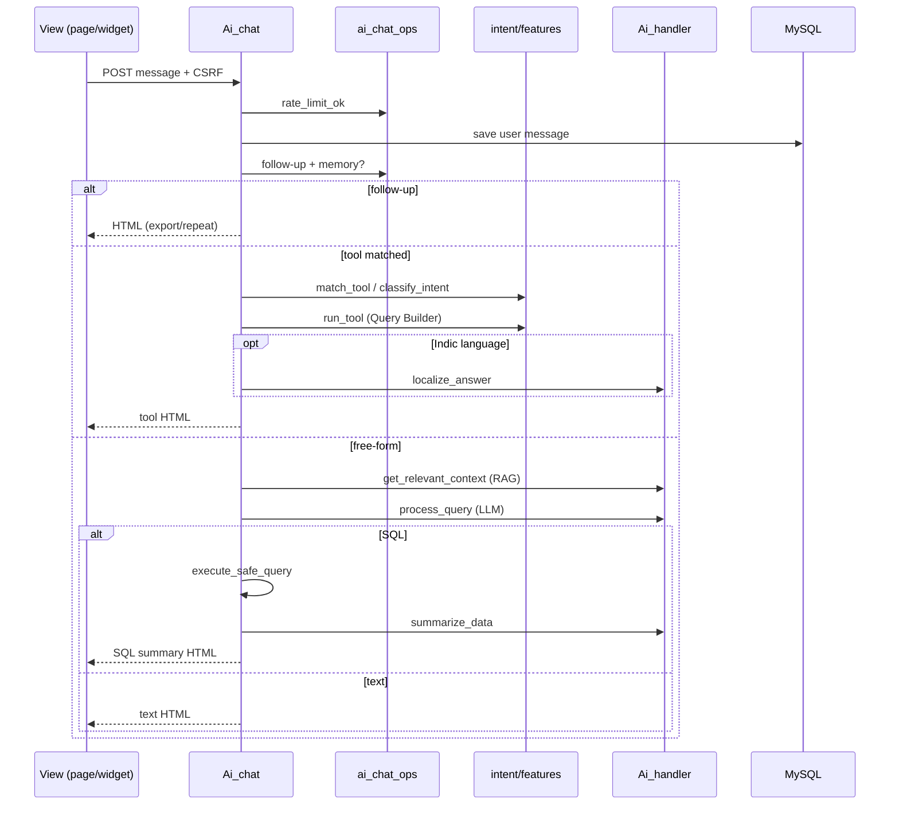

# Office AI Chat — कसा काम करतो आणि कसा बनवला

हे document दोन गोष्टी सांगते:

1. **User input दिल्यानंतर chatbot कसा work करतो** (runtime flow)
2. **आम्ही हे कसे design / build केले** (architecture, layers, decisions)

Related short plan: [`AI_CHAT_ADVANCED_PLAN.md`](AI_CHAT_ADVANCED_PLAN.md)

---

## 1. एका वाक्यात काय आहे?

Office AI हा **tools-first** office assistant आहे.

- सामान्य HR प्रश्नांसाठी (leave, attendance, tasks, SPL) → **deterministic tools** (Query Builder + fixed SQL)
- बाकी प्रश्नांसाठी → **RAG schema context + LLM** (SQL किंवा plain text)
- प्रत्येक answer → **RBAC + hierarchy + data_scope** ने scoped
- UI → full page chat + footer floating widget (दोन्ही same backend)

---

## 2. File map (layers)

```
View
  application/views/ai_chat/index.php     ← full page chat
  application/views/partials/footer.php   ← floating widget

Controller
  application/controllers/Ai_chat.php     ← orchestration (main brain of turn)

Helpers
  ai_chat_intent_helper.php               ← multilingual lexicon / intent score
  ai_chat_features_helper.php             ← tools, schema whitelist, data scope SQL
  ai_chat_ops_helper.php                  ← memory, rate limit, audit, chips, deep links
  ai_sql_guard_helper.php                 ← SQL deny-list / scrub / audit

Library
  application/libraries/Ai_handler.php    ← LLM providers, RAG, classify, summarize, TTS

Model
  Ai_conversation_model                   ← conversations + messages persistence

CLI tests
  Ai_chat_test_cli.php                    ← php index.php ai_chat_test_cli run|eval
```

CI3 pattern: **Controller orchestrates → Helpers for domain logic → Library for AI → Model for DB**. Service layer / DI नाही.

---

## 3. User input → Response (पूर्ण flow)

### 3.1 UI वर काय होते

1. User message type करतो (full page किंवा widget).
2. JS `POST` करतो:
   - Route: `ai-chat/send` / `ai_chat/send_message`
   - Body: `message` + CSRF token
3. Backend JSON परतवतो:

```json
{
  "status": "success",
  "response": "<HTML answer>",
  "csrf_token": "...",
  "conversation_id": 123,
  "source": "tool|sql|text|followup|sql_error|ai",
  "tool": "my_leave_balance"
}
```

4. UI मध्ये:
   - User message → `escapeHtml` (XSS safe)
   - Assistant HTML → `sanitizeAiHtml` (script / on* / javascript: strip)

Optional SSE: `ai-chat/send-stream` — progress events (`status`) + final `done`. मुख्य UI आज JSON POST वापरते.

---

### 3.2 Backend pipeline (`Ai_chat::_handle_chat_turn`)

हे **सर्वात महत्वाचे** function आहे. प्रत्येक chat turn इथेच resolve होतो.

```
POST send_message
        │
        ▼
┌───────────────────────┐
│ 1. Rate limit (60/hr) │  ai_chat_rate_limit_ok()
└───────────┬───────────┘
            ▼
┌───────────────────────┐
│ 2. User + conversation│  session + Ai_conversation_model
│    history save (user)│
└───────────┬───────────┘
            ▼
┌───────────────────────┐
│ 3. Follow-up?         │  ai_chat_is_followup + memory
│    export / repeat    │  → finalize → STOP
└───────────┬───────────┘
            ▼ (नाही तर)
┌───────────────────────┐
│ 4. Tools-first intent │  ai_chat_match_tool (lexicon)
│    weak → LLM classify│  Ai_handler::classify_intent
│    tool → run_tool    │  ai_chat_run_tool
│    (+ localize EN/MR) │  → finalize → STOP
└───────────┬───────────┘
            ▼ (tool नाही / fail)
┌───────────────────────┐
│ 5. RAG context        │  get_relevant_context()
└───────────┬───────────┘
            ▼
┌───────────────────────┐
│ 6. LLM process_query  │  SQL JSON किंवा text JSON
└───────────┬───────────┘
            ▼
     ┌──────┴──────┐
     ▼             ▼
 sql_query        text
     │             │
     ▼             ▼
 execute_safe   finalize(text)
 summarize/export
 finalize(sql)
```

---

### 3.3 Step-by-step detail

#### Step 1 — Access + rate limit

- Constructor: `require_module_access(['ai', 'ai_chat'], true)`
- Session `user_id` घेतो
- `ai_chat_rate_limit_ok($user_id, 60)` → 1 तासात max 60 turns (session bucket)
- Fail → `{ status: error, message, csrf_token }`

#### Step 2 — Conversation setup

- Active conversation resolve: `owns` / `get_or_create_active`
- Session keys: `ai_conversation_id`, `ai_conversation_history`
- History trim → last **10** for this LLM turn
- User message append → DB `ai_conversation_messages`

#### Step 3 — Follow-up shortcut (LLM न घेता)

Session memory (`ai_chat_memory`): `last_tool`, `last_rows`, `last_html`, `last_query`

| User म्हणतो | Action |
|-------------|--------|
| export / csv / excel / pdf | `generate_export_file(last_rows)` |
| “same again” / repeat | `last_html` परत |
| short filter hint | “Tell me the filter…” |

हे P2 feature आहे — short follow-ups साठी LLM खर्च वाचतो.

#### Step 4 — Tools-first intent

**का?** “माझा leave balance किती?” सारखे प्रश्न LLM SQL वर सोडले तर unreliable. म्हणून fixed tools.

1. `ai_chat_match_tool($message)`
   - Message normalize (typos / transliteration: `mazya` → my, `;eaes` → leaves)
   - Lexicon bags: EN / HI / MR / BN / AR
   - Score: `need` words required, total ≥ 3 → tool accept
2. Lexicon weak/null → `Ai_handler::classify_intent($message)`
   - LLM returns `{"tool":"..."}` (whitelist only; `none` → null)
3. Tool मिळाले → `ai_chat_run_tool($tool, $user_id, $db)`
   - CI Query Builder (deterministic)
   - Hierarchy / self-scope apply
   - HTML answer + rows
4. जर message Indic/Hinglish असेल → `localize_answer()` (LLM HTML language match)
5. Export buttons append, memory set, audit `source=tool`
6. `_finalize_assistant_turn` → **STOP** (SQL path नाही)

**Known tools**

| Tool key | अर्थ |
|----------|------|
| `my_leave_balance` | स्वतःचे leave balances |
| `my_pending_leaves` | स्वतःचे pending leave |
| `who_on_leave_today` | आज approved leave (hierarchy) |
| `who_late_today` | आज late (hierarchy) |
| `my_attendance_today` | स्वतःची attendance |
| `my_open_tasks` | open tasks |
| `my_daily_activity_today` | daily work logs |
| `spl_pending_approvals` | SPL queue (approver RBAC) |
| `my_spl_points` | SPL points |

#### Step 5 — RAG (schema context)

Tool match न झाल्यास:

- `get_relevant_context($message)`
- Embeddings: Gemini `embedding-001`
- Store: `application/libraries/ai_vectors.json`
- Cosine similarity; hits **RBAC-allowed tables** वर filter
- Weak match → full allowed schema देतो

#### Step 6 — LLM `process_query`

System prompt **per-user, dynamic** (`ai_chat_build_process_system_prompt`):

- Allowed modules (`has_module_access` / accessible list)
- Allowed tools from `ai_chat_tool_catalog()` (RBAC-filtered)
- Allowed schema only (live `list_fields`, table→module from `config/table_module_mapping.php`)
- Logged-in user + date + short history
- Optional Settings override: `ai_chat_system_prompt` (empty = built-in dynamic template)

Expected JSON:

```json
{ "type": "sql_query", "query": "SELECT ..." }
```
किंवा

```json
{ "type": "text", "text": "..." }
```

#### Step 7a — जर `sql_query`

`execute_safe_query($sql, $user_id)` — defense in depth:

1. SELECT only; comments strip
2. Block: DROP/UPDATE/DELETE/INSERT/UNION/INTO/multi-statement
3. `ai_sql_guard_check` (deny tables/columns)
4. Per-table module RBAC (`ai_chat_table_module_map`)
5. `ai_chat_enforce_data_scope_sql` (staff → own rows)
6. Hierarchy inject (`attendance`, `leave_requests`, `daily_work_logs`)
7. `LIMIT` ≤ 100
8. Run on `ai_readonly` DB group (जर configured)
9. `ai_sql_scrub_result` (sensitive columns)

नंतर:

- User ने file/report/export मागितले → CSV/Excel/PDF
- नाहीतर → `summarize_data()` (LLM → HTML summary)
- Memory + audit `source=sql`
- Finalize

#### Step 7b — जर `text`

Plain assistant text → audit `source=text` → finalize.

#### Step 8 — Finalize

`_finalize_assistant_turn`:

1. Assistant turn session history मध्ये
2. DB message + `meta_json` (source/tool)
3. JSON success payload + fresh CSRF

---

## 4. Sequence diagram



---

## 5. LLM providers कसे call होतात

`Ai_handler::call_llm_with_fallback($system, $user)`:

```
1. Custom providers (settings JSON, OpenAI-compatible)
2. OpenAI          (default gpt-4o-mini)
3. Gemini          (flash-first model list)
4. OpenRouter      (claude-3.5-sonnet)
5. HuggingFace
→ सर्व fail → error string
```

Keys: `settings` table (`ai_{provider}_enabled`, `ai_{provider}_api_key`) — code मध्ये hardcode नाही.

मुख्य LLM uses:

| Method | काय करतो |
|--------|----------|
| `classify_intent` | NL → tool key |
| `process_query` | NL → SQL किंवा text |
| `summarize_data` | rows → HTML |
| `localize_answer` | tool HTML → user language |
| `text_to_speech` | Azure TTS → mp3 |

---

## 6. Security layers (का महत्वाचे)

Chatbot DB touch करतो म्हणून multi-layer:

| Layer | काय |
|-------|-----|
| Module RBAC | `ai` / `ai_chat` permission; table → module map |
| Schema whitelist | LLM ला फक्त allowed tables दिसतात |
| RAG filter | vector hits → allowed tables only |
| SQL guards | SELECT-only + deny lists + scrub |
| Data scope | staff स्वतःचे rows |
| Hierarchy | managers फक्त team data |
| SPL tool RBAC | approver permissions |
| Rate limit | abuse control |
| XSS | user escape + assistant sanitize |
| Audit | `ai_chat_intent_log` + `security_audit_log` |

Write actions (apply leave इ.) **out of scope** — confirm modal नंतर.

---

## 7. Database / storage

| Store | Purpose |
|-------|---------|
| `ai_conversations` | per-user threads |
| `ai_conversation_messages` | user/assistant + meta |
| `ai_chat_intent_log` | intent audit |
| `security_audit_log` | SQL executed/blocked |
| Domain tables | leave, attendance, tasks, SPL, users… |
| `settings` | AI API keys (queryable via AI नाही) |
| `ai_vectors.json` | RAG embeddings file |
| `uploads/reports/` | CSV/Excel/PDF |
| `uploads/tts/` | voice mp3 |

---

## 8. Routes

| URL | Method |
|-----|--------|
| `ai-chat` / `ai_chat` | page |
| `ai-chat/send` / `ai_chat/send_message` | JSON turn |
| `ai-chat/send-stream` | SSE turn |
| `ai-chat/new` | new conversation |
| `ai-chat/load` | load conversation |
| `ai-chat/export` | download file |
| `ai-chat/clear-history` | clear |
| `ai-chat/tts` | speech |
| `ai-chat/reindex` | admin RAG rebuild |
| `ai-chat/confirm-sql` | legacy SQL confirm (auto-run preferred) |

---

## 9. आम्ही हे कसे बनवले (build story)

### 9.1 Design principle

**“Common office questions = tools. Rare questions = guarded LLM SQL.”**

कारण:

- Leave/attendance प्रश्नांवर LLM SQL hallucinate करू शकतो
- Tools = predictable, testable, RBAC-safe
- LLM फक्त fallback + summarization + multilingual polish

### 9.2 Build order (P0 → P5)

Plan file प्रमाणे:

| Phase | काय जोडले |
|-------|-----------|
| P0 | Plan doc |
| P1 | More tools + hard hierarchy on org tools |
| P2 | Follow-up memory (`last_tool`, `last_rows`, …) |
| P3 | Suggestion chips + conversation sidebar |
| P4 | SQL confirm gate → नंतर auto-run + deep links |
| P5 | Rate limit + intent audit + CLI eval suite |

### 9.3 Security pass (2026-07-17)

- Full-page + widget XSS hardening
- SQL confirm UI (legacy) full query scrollable
- SPL pending: approver RBAC + hierarchy
- RAG: only user’s allowed tables

### 9.4 का हे architecture निवडले

1. **CI3-native** — controllers/helpers/libraries; Laravel-style services नाही
2. **Helpers split** — intent / features / ops वेगळे → testable + readable
3. **Provider fallback** — एक API down असला तरी chat चालू
4. **Multilingual without MuRIL** — lexicon + LLM classify/localize (external Indic APIs out of scope)
5. **Session memory + DB history** — short follow-ups fast; long history persistent
6. **CLI eval** — `php index.php ai_chat_test_cli run` / `eval` — live LLM न घेता intent/tools check

### 9.5 Out of scope (आत्ता नाही)

- Write actions (apply leave) + confirm modal
- True token streaming / voice-in ASR
- Chart rendering
- External Indic translation APIs / MuRIL models

---

## 10. Example walkthrough

### Example A — Tool path

User: **“माझा leave balance किती?”**

1. Rate OK  
2. Message save  
3. Follow-up? नाही  
4. `ai_chat_match_tool` → `my_leave_balance` (MR lexicon score)  
5. `ai_chat_run_tool` → Query Builder on leave tables where `user_id = me`  
6. Indic detected → `localize_answer`  
7. Export buttons + memory  
8. JSON `{ source: "tool", tool: "my_leave_balance", response: "<html>…" }`

LLM SQL path **skip** — fast + accurate.

### Example B — LLM SQL path

User: **“Last month IT department मध्ये किती late होते?”**

1. Tool match fail / weak  
2. `classify_intent` → none  
3. RAG → attendance + users schema snippets  
4. `process_query` → SELECT SQL  
5. `execute_safe_query` → hierarchy + module checks + LIMIT  
6. `summarize_data` → HTML  
7. `{ source: "sql", response: "…" }`

### Example C — Follow-up

User नंतर: **“excel मध्ये दे”**

1. `ai_chat_is_followup` → `export_excel`  
2. Memory `last_rows` → file generate  
3. Download link — LLM/SQL पुन्हा नाही

---

## 11. Tests कसे चालवायचे

```bash
php index.php ai_chat_test_cli run
php index.php ai_chat_test_cli eval
```

Intent lexicon + tool wiring CLI वर verify होते (deep eval suite P5).

---

## 12. Quick “कुठे पहावे” index

| तुम्हाला हवे असलेले | File / function |
|---------------------|-----------------|
| पूर्ण turn logic | `Ai_chat::_handle_chat_turn` |
| Intent lexicon | `ai_chat_match_tool`, `ai_chat_score_intent` |
| Tool SQL | `ai_chat_run_tool` |
| Memory / rate / audit | `ai_chat_ops_helper.php` |
| LLM + RAG | `Ai_handler.php` |
| SQL safety | `execute_safe_query` + `ai_sql_guard_helper` |
| UI send | `views/ai_chat/index.php` → `sendMessage()` |
| Widget send | `partials/footer.php` → `handleWidgetSubmit()` |
| Feature roadmap | `docs/AI_CHAT_ADVANCED_PLAN.md` |

---

**Bottom line:** User message → rate limit → conversation save → follow-up? → multilingual tool? → नाहीतर RAG + LLM SQL/text (heavily guarded) → HTML JSON. Common office Qs deterministic tools वर; rare Qs LLM वर — हीच Office AI ची मुख्य design.
