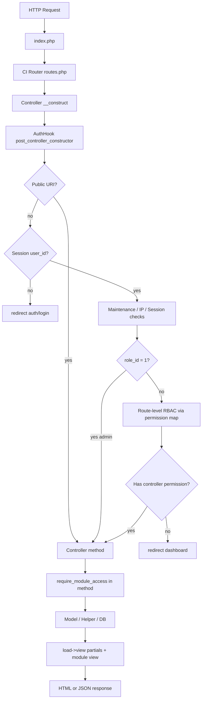
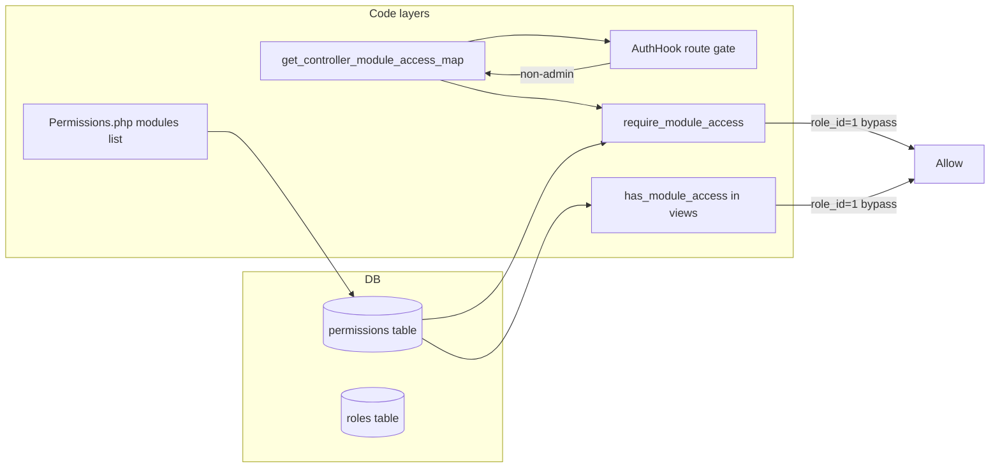
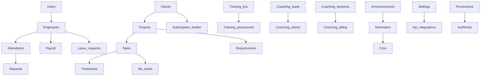

# Office Management System — Functional Graph

> Auto-generated reference map · 2026-06-29 · Regenerate: `python tools/generate_functional_graph.py`

## How to use (AI / new sessions)

1. **Read this file first** before exploring the full codebase — saves tokens.
2. Find your module in [Domain Modules](#domain-modules) → follow Controller → Model → View chain.
3. Check [RBAC keys](#rbac--permission-flow) in `permission_helper.php` + `Permissions.php`.
4. Routes: `application/config/routes.php` or `docs/user-guide/_ROUTE_INDEX.md`.
5. User-facing docs: `docs/user-guide/` + `module_catalog.json`.

---

## System stack

| Layer | Location | Notes |
|-------|----------|-------|
| Framework | CodeIgniter 3 | `system/` has PHP 8.4 patches |
| App | `application/` | controllers, models, views, helpers, hooks |
| Entry | `index.php` | Front controller |
| Default route | `auth` | Login page |
| Layout | `views/partials/header`, `sidebar`, `footer` | Bootstrap 5 UI |

---

## Request lifecycle

---

## RBAC & permission flow

**Rules:**
- `role_id = 1` (Super Admin): bypasses all RBAC in `has_module_access()` and AuthHook.
- **Office Meals exception**: uses `meal_helper.php` (`require_meal_access`) — **no admin bypass**.
- Coaching controllers extend `Coaching_Controller` → `coaching_require_access($coaching_permission)`.
- Permission matrix source of truth: `Permissions.php` → `modules()` + `get_controller_module_access_map()`.
- Always-allowed controllers (AuthHook): `dashboard`, `profile`, `auth`, `errors`, `cron`, `coaching_portal`, etc.

---

## Public endpoints (no login)

| Pattern | Purpose |
|---------|---------|
| `auth/login`, `login`, `auth/register`, `register` | Login / registration |
| `auth/send-verify-code`, `auth/verify-code`, `auth/verify-2fa` | Email / 2FA verification |
| `auth/forgot_password`, `auth/reset_password` | Password reset |
| `install/schema` | DB installer |
| `training-assessment/take/*`, `training_assessment_take/*` | Candidate assessment (token) |
| `coaching-webhooks/razorpay`, `coaching-webhooks/whatsapp-inbound`, `whatsapp/webhook` | Payment / Meta WhatsApp webhooks |
| `coaching-leads/workshop-register/*` | Public workshop registration |

---

## Autoloaded helpers (every request)

`url`, `form`, `download`, `permission`, `attendance`, `training`, `company`, `api_integration`, `error_handler`, `notification`, `hierarchy_filter`, `data_scope`, `coaching`, `schema_columns`, `view_output`

**Key helpers by concern:**

| Helper | Role |
|--------|------|
| `permission_helper` | RBAC: has/require module access, controller map |
| `data_scope_helper` | Org-wide vs own-record filtering |
| `hierarchy_filter_helper` | Manager/lead team visibility |
| `attendance_helper` | Punch, shifts, geo, export |
| `my_works_*` | Personal work items, attachments, matrix |
| `coaching_helper` | Coaching CRM access + notifications |
| `meal_helper` | Office Meals strict RBAC |
| `training_helper` | LMS + assessment screen gates |
| `api_integration_helper` | Credentials from `api_integrations` table |
| `notification_helper` | In-app + push notifications |

---

## Core classes (`application/core/`)

| Class | Purpose |
|-------|---------|
| `Coaching_Controller` | Base for coaching admin modules; loads Coaching_model + coaching_require_access() |
| `Reports_base` | Shared report helpers; auto require_module_access(reports keys) |
| `Org_structure_trait` | Department/designation hierarchy helpers for controllers |
| `Schema_columns_trait` | Runtime column existence checks |
| `MY_Security` | CSRF / security overrides for PHP 8.4 |
| `MY_Exceptions` | Custom exception rendering |

---

## Domain modules

### 01 — Auth & Core

| Controller | Extends | Models | Primary views | RBAC keys (first 3) | Key methods |
|------------|---------|--------|---------------|---------------------|-------------|
| `Auth` | CI_Controller | User_model, Setting_model, Security_audit_model | auth/login, auth/verify_2fa | — | index, login, verify_2fa, logout, send_verify_code, verify_code… |
| `Dashboard` | CI_Controller | External_dashboard_model | dashboard/index | dashboard | index |
| `Profile` | CI_Controller | Setting_model, Security_audit_model, User_model, Employee_model | profile/index_enhanced, profile/edit | — | index, edit, remove_avatar, delete_profile |
| `Guide` | CI_Controller | — | guide/index, guide/module | guide | index, module |
| `Errors` | CI_Controller | — | errors/permission_denied, errors/page_missing | — | permission_denied, page_missing |
| `Welcome` | CI_Controller | — | — | — | index |
| `Install` | CI_Controller | — | — | — | schema, get_schema_sql |
| `Migrate` | CI_Controller | — | — | — | index |
| `Short_url` | CI_Controller | — | — | — | redirect, stats |
| `Test_company` | CI_Controller | — | — | — | index |

### 02 — People & Org

| Controller | Extends | Models | Primary views | RBAC keys (first 3) | Key methods |
|------------|---------|--------|---------------|---------------------|-------------|
| `Users` | CI_Controller | User_model, Face_model, Employee_model, Shift_model | users/index, users/form | users, users_list, users_add… | index, check_email, check_phone, create, store, edit… |
| `Employees` | CI_Controller | Type_model, Employee_model, Shift_model | employees/list, employees/form | employees, employees_list, employees_add… | index, create, show, edit, generate_emp_code, delete… |
| `Departments` | CI_Controller | Department_model | departments/index, departments/form | departments | ensure_schema, index, create, edit, delete, restore |
| `Designations` | CI_Controller | Designation_model | designations/index, designations/form | designations | ensure_schema, index, create, edit, delete, restore |
| `Roles` | CI_Controller | Role_model | roles/index | roles, permissions | index, store, update, delete, ensure_schema |
| `Permissions` | CI_Controller | Role_model | permissions/index | permissions | ensure_schema, roles, modules, index, save |
| `Shifts` | CI_Controller | Shift_model | shifts/index, shifts/form | shifts, shifts_view, shifts_manage | index, create, edit, delete |
| `Lead_mapping` | CI_Controller | Lead_user_mapping_model | lead_mapping/index | lead_mapping | index, save |
| `Clients` | CI_Controller | Client_model, Type_model | clients/index, clients/create | clients, clients_list, clients_add… | ensure_schema, upload_logo, index, create, view, edit… |

### 03 — Attendance & Leave

| Controller | Extends | Models | Primary views | RBAC keys (first 3) | Key methods |
|------------|---------|--------|---------------|---------------------|-------------|
| `Attendance` | CI_Controller | Attendance_model, Face_model, Setting_model, Holiday_model | attendance/index, attendance/create | attendance, attendance_list, attendance_add… | attendance_field_exists, attendance_has_column_fn, index, get_user_monthly_attendance, bulk_operations, create… |
| `Leaves` | CI_Controller | Leave_model | leaves/index | leaves, leaves_list, leaves_add… | index, export_csv, test_email |
| `Leave_requests` | CI_Controller | Leave_request_model, Approval_model, Setting_model | leave_requests/apply, leave_requests/my | leave_requests, leave_team, leave_approve… | apply, my, team, approve, reject, calendar… |

### 04 — Projects & Work

| Controller | Extends | Models | Primary views | RBAC keys (first 3) | Key methods |
|------------|---------|--------|---------------|---------------------|-------------|
| `Projects` | CI_Controller | Type_model, Project_model, Status_model | projects/list, projects/matrix | projects, projects_list, projects_add… | index, matrix, create, show, edit, delete… |
| `Tasks` | CI_Controller | Task_model, Reminder_model, Status_model, Notification_model | tasks/list, tasks/form | tasks, tasks_list, tasks_add… | index, create, preview, show, edit, delete… |
| `Requirements` | CI_Controller | Type_model, Reminder_model, Notification_model, Status_model | requirements/index, requirements/create | requirements, requirements_list, requirements_add… | ensure_schema, index, create, edit, view, version… |
| `My_works` | CI_Controller | My_work_model, Template_task_model, Type_model, Status_model | my_works/overview, my_works/overview_hub | my_works, my_works_list, my_works_add… | ensure_schema, index, todays_focus, export, quick_add, template_tasks… |
| `Timesheets` | CI_Controller | Timesheet_model | timesheets/index, timesheets/report | timesheets, timesheets_list, timesheets_add… | index, submit, approve, reject, delete_entry, report… |
| `Daily_activity` | CI_Controller | — | daily_activity/index, daily_activity/list | daily_activity, daily_activity_add, daily_activity_list… | ensure_table, index, list_all, save, edit, export… |
| `Statuses` | CI_Controller | Status_model | statuses/index, statuses/form | statuses | index, create, view, show, edit, delete |
| `Types` | CI_Controller | — | — | types | index, create, view, show, edit, delete |
| `Subscription_builder` | CI_Controller | Subscription_builder_model, Elintom_proposals_model | subscription_builder/index | subscription_builder, subscription_builder_list | ensure_schema, index, catalog, quote_preview, quote_save, quote_pdf… |
| `Elintom_proposals` | CI_Controller | Elintom_proposals_model | elintom_proposals/index | elintom_proposals, elintom_proposals_list | ensure_schema, index, download |

### 05 — HR & Finance

| Controller | Extends | Models | Primary views | RBAC keys (first 3) | Key methods |
|------------|---------|--------|---------------|---------------------|-------------|
| `Payroll` | CI_Controller | Payroll_model, Setting_model | payroll/structures, payroll/structure_form | payroll, payroll_view, payroll_manage | index, structures, structure, payslips, send_payslips, generate… |
| `Expenses` | CI_Controller | Expense_model | expenses/index, expenses/create | expenses, expenses_add, expenses_edit… | ensure_schema, index, create, view, approve, reject… |
| `Performance` | CI_Controller | Performance_model, Employee_model | performance/index, performance/create | performance, performance_create, performance_view… | index, create, view, edit, delete, export… |
| `Recruitment` | CI_Controller | Recruitment_model, User_model | recruitment/jobs, recruitment/create_job | recruitment, recruitment_jobs, recruitment_candidates… | index, create_job, edit_job, delete_job, close_job, candidates… |
| `Assets` | CI_Controller | Asset_model | assets/index, assets/form | assets, assets_mgmt, assets_manage… | can_manage_assets, index, create, edit, assign, return_asset… |
| `Approvals` | CI_Controller | Approval_model | approvals/index, approvals/form | approvals | index, create, edit, save, delete |

### 06 — Reports & Analytics

| Controller | Extends | Models | Primary views | RBAC keys (first 3) | Key methods |
|------------|---------|--------|---------------|---------------------|-------------|
| `Reports` | Reports_base | — | reports/dashboard | reports, reports_overview, reports_requirements… | index, export_csv |
| `Reports_attendance` | Reports_base | Employee_model, Shift_model | reports/attendance_employee_detail, reports/attendance_employee | reports, reports_overview, reports_attendance… | attendance_employee, attendance, export_attendance_employee, build_attendance_export_summaries, export_attendance_data, export_attendance_employee_excel… |
| `Reports_hr` | Reports_base | — | reports/leaves, reports/payroll | reports, reports_overview, reports_leaves… | leaves, export_leaves_csv, payroll, expenses, performance |
| `Reports_projects` | Reports_base | — | reports/requirements, reports/tasks_assignment | reports, reports_overview, reports_requirements… | requirements, export_requirements_csv, tasks_assignment, export_tasks_assignment_csv, daily_activity, projects_status… |
| `Analytics` | CI_Controller | Ai_model, Integration_model, Chat_model | analytics/dashboard | analytics, reports | index, save_integrations, start_quick_call, analyze_feedback, parse_resume, calendar_feed |
| `Ai_chat` | CI_Controller | Ai_model, Chat_model, User_model | ai_chat/index | ai, ai_chat, ai_widget | index, send_message, tts, execute_safe_query, generate_export_file, generate_csv_file… |

### 07 — Communication

| Controller | Extends | Models | Primary views | RBAC keys (first 3) | Key methods |
|------------|---------|--------|---------------|---------------------|-------------|
| `Chats` | CI_Controller | Chat_model | chats/index, chats/app | chats, chats_list, chats_add… | index, app, start_dm, create_group, conversation, send_message… |
| `Calls` | CI_Controller | Call_model | — | calls, chats | start, signal, poll_signals, end, poll_incoming, poll_incoming_any |
| `Announcements` | CI_Controller | Announcement_model, Reminder_model | announcements/index, announcements/form | announcements, announcements_list, announcements_add… | ensure_schema, can_manage, broadcast_if_published, index, create, edit… |
| `Notifications` | CI_Controller | Notification_model | notifications/index | notifications | index, count, recent, mark_read, mark_all_read, delete… |
| `Reminders` | CI_Controller | Reminder_model, Setting_model | reminders/dashboard, reminders/send_enhanced | reminders, reminders_list, reminders_add… | index, dashboard, cron_morning, cron_night, send_queue, send_selected… |
| `Mail` | CI_Controller | Setting_model | mail/index | mail, settings, admin | index, send, test |
| `Sendgrid` | CI_Controller | — | sendgrid/index | sendgrid, email_settings, settings… | index, send, test |
| `Whatsapp` | CI_Controller | Whatsapp_model | whatsapp/index, whatsapp/templates | whatsapp | index, templates, sync_templates, send_template, add_template, delete_template, test_connection, webhook, reply, start, send, send_task, send_report |
| `Activity` | CI_Controller | — | activity/index | activity | index, export, get_record_data |

### 08 — Training & LMS

| Controller | Extends | Models | Primary views | RBAC keys (first 3) | Key methods |
|------------|---------|--------|---------------|---------------------|-------------|
| `Training_assessment` | CI_Controller | Training_assessment_model, Employee_model, Notification_model, Security_audit_model | partials/header, partials/footer | training_assessment, training_assessment_manage, training_assessment_take… | index, dashboard, create_assessment, save_assessment, delete_assessment, duplicate_assessment… |
| `Training_assessment_take` | CI_Controller | Training_assessment_model, Security_audit_model | training_assessment/candidate_register, training_assessment/take_assessment | training_assessment, training_assessment_manage, training_assessment_take… | candidate_profile, take_assessment, retake_assessment, ajax_load_question, ajax_save_answer, ajax_run_code… |
| `Training_lms` | CI_Controller | Training_lms_module_model, Training_lms_topic_model, Training_lms_assignment_model, Training_lms_enrollment_model | training_lms/index, training_lms/learner_hub | training_lms, training_lms_manage, training_screen_tl_hub… | index, learner_hub, module, topic, start_assessment, complete_topic… |
| `Training_lms_admin` | CI_Controller | Training_lms_module_model, Training_lms_topic_model, Training_lms_assignment_model, Training_lms_enrollment_model | training_lms/admin/index, training_lms/admin/module_form | training_lms_manage, training_screen_lms_admin, training_screen_lms_submissions… | index, module_form, save_module, delete_module, topics, module_enrollments… |
| `Training_import` | CI_Controller | — | training/import | training_assessment, training_assessment_manage, training_screen_ta_import… | index, sample, process |
| `External_training` | CI_Controller | External_training_model | external_training/index, external_training/watch | external_training, external_training_watch, external_training_list… | can_any_external_training, index, watch, normalize_embed_for_watch, looks_like_http_url, normalize_stream_url… |

### 09 — Coaching CRM

| Controller | Extends | Models | Primary views | RBAC keys (first 3) | Key methods |
|------------|---------|--------|---------------|---------------------|-------------|
| `Coaching` | Coaching_Controller | — | coaching/dashboard | coaching, coaching_coaches, coaching_clients… | index |
| `Coaching_admin` | Coaching_Controller | — | coaching/admin/index | coaching:coaching_admin | index, backup, run_automation |
| `Coaching_billing` | Coaching_Controller | — | coaching/billing/index, coaching/billing/invoice | coaching:coaching_billing | index, save_program, create_invoice, invoice, mark_paid, payouts |
| `Coaching_clients` | Coaching_Controller | — | coaching/clients/index, coaching/clients/form | coaching:coaching_clients | index, create, edit, view |
| `Coaching_coaches` | Coaching_Controller | — | coaching/coaches/index, coaching/coaches/form | coaching:coaching_coaches | index, create, edit, delete |
| `Coaching_goals` | Coaching_Controller | — | coaching/goals/index | coaching:coaching_goals | index, save_goal, save_homework |
| `Coaching_leads` | Coaching_Controller | — | coaching/leads/index, coaching/leads/form | coaching:coaching_leads | coaching_skip_access, index, create, edit, convert, workshops… |
| `Coaching_payments` | CI_Controller | Coaching_model | coaching/billing/pay, coaching/billing/pay_success | coaching_billing, coaching, coaching_portal | pay, verify, webhook, confirm_manual, success |
| `Coaching_portal` | CI_Controller | Coaching_model | coaching/portal/dashboard | — | index, homework_done |
| `Coaching_reports` | Coaching_Controller | — | coaching/reports/index | coaching:coaching_reports | index |
| `Coaching_resources` | Coaching_Controller | — | coaching/resources/index | coaching:coaching_resources | index, save |
| `Coaching_sessions` | Coaching_Controller | — | coaching/sessions/index, coaching/sessions/calendar | coaching:coaching_sessions | index, calendar, create, edit, delete |
| `Coaching_webhooks` | Coaching_Controller | — | — | — | coaching_skip_access, razorpay, whatsapp_inbound |
| `Coaching_whatsapp_crm` | Coaching_Controller | — | coaching/whatsapp/index | coaching:coaching_whatsapp_crm | index, save_enquiry, broadcast |

### 10 — Admin & Settings

| Controller | Extends | Models | Primary views | RBAC keys (first 3) | Key methods |
|------------|---------|--------|---------------|---------------------|-------------|
| `Settings` | CI_Controller | Setting_model, Leave_type_model, Holiday_model, Type_model | settings/index, settings/holidays/index | settings, holidays, holidays_add… | ensure_leave_types_schema, ensure_holidays_schema, index, update, remove_logo, upload_logo… |
| `System_settings` | CI_Controller | — | system_settings/index, system_settings/permissions | system_settings, settings, admin | ensure_schema, ensure_external_training_role_permissions, default_external_training_role_perms, index, update_settings, permissions… |
| `Email_settings` | CI_Controller | — | email_settings/index, email_settings/edit_template | email_settings, settings, admin | ensure_schema, index, edit_template, update, user_preferences, get_module_info… |
| `Api_integrations` | CI_Controller | Api_integration_model | api_integrations/index, api_integrations/form | api_integrations, settings, admin | index, create, store, edit, update, delete |
| `Db` | CI_Controller | Client_model | db/index, db/client_panel | db, db_admin | get_csrf_token, compare_update_file_missing, compare_drop_db_only, list_databases, compare_scan, compare_merge… |
| `Superadmin` | CI_Controller | — | superadmin/dashboard | superadmin | index, phpinfo |
| `Cron` | CI_Controller | Setting_model, Announcement_model, Reminder_model, Reward_model | — | — | process_announcements, send_emails, run_all, setup_help, rewards_leaderboard, rewards_attendance_penalties… |

### 11 — Engagement & Rewards

| Controller | Extends | Models | Primary views | RBAC keys (first 3) | Key methods |
|------------|---------|--------|---------------|---------------------|-------------|
| `Releases` | CI_Controller | Engagement_model, Defect_model, Reminder_model | releases/index, releases/form | releases, releases_add, releases_edit… | index, create, edit, send_notes, form_view_data, dispatch_release_notes |
| `Defects` | CI_Controller | Defect_model | defects/index, defects/form | defects, defects_list, defects_add… | index, create, view, edit, delete |
| `Knowledge_base` | CI_Controller | Engagement_model | knowledge_base/index, knowledge_base/view | knowledge_base, knowledge_base_add, knowledge_base_edit | index, view, create, edit |
| `Helpdesk` | CI_Controller | Engagement_model | helpdesk/index, helpdesk/form | helpdesk, helpdesk_manage | index, create, edit |
| `Events` | CI_Controller | Engagement_model | events/index, events/form | events, events_add, events_edit | index, create, edit |
| `Certifications` | CI_Controller | Engagement_model | certifications/index, certifications/form | certifications, certifications_approve | index, create, approve, reject |
| `Customer_feedback` | CI_Controller | Engagement_model, Ai_model | customer_feedback/index, customer_feedback/form | customer_feedback | index, create |
| `Rewards` | CI_Controller | Reward_model | rewards/index, rewards/history | rewards, rewards_leaderboard, rewards_submit… | index, history, leaderboard, cheer, rules, edit_rule… |

### 12 — Office Meals

| Controller | Extends | Models | Primary views | RBAC keys (first 3) | Key methods |
|------------|---------|--------|---------------|---------------------|-------------|
| `Meals` | CI_Controller | Meal_model | meals/index, meals/calendar | meals_order, meals_calendar, meals_provider… | index, save_order, submit_request, review_request, meal_json, calendar… |

---

## Controller → Model map (full)

- **Ai_chat**: Ai_model, Chat_model, User_model
- **Analytics**: Ai_model, Integration_model, Chat_model
- **Announcements**: Announcement_model, Reminder_model
- **Api_integrations**: Api_integration_model
- **Approvals**: Approval_model
- **Assets**: Asset_model
- **Attendance**: Attendance_model, Face_model, Setting_model, Holiday_model, Shift_model, Employee_model
- **Auth**: User_model, Setting_model, Security_audit_model
- **Calls**: Call_model
- **Certifications**: Engagement_model
- **Chats**: Chat_model
- **Clients**: Client_model, Type_model
- **Coaching_payments**: Coaching_model
- **Coaching_portal**: Coaching_model
- **Cron**: Setting_model, Announcement_model, Reminder_model, Reward_model, Coaching_model, Meal_model
- **Customer_feedback**: Engagement_model, Ai_model
- **Dashboard**: External_dashboard_model
- **Db**: Client_model
- **Defects**: Defect_model
- **Departments**: Department_model
- **Designations**: Designation_model
- **Elintom_proposals**: Elintom_proposals_model
- **Employees**: Type_model, Employee_model, Shift_model
- **Events**: Engagement_model
- **Expenses**: Expense_model
- **External_training**: External_training_model
- **Helpdesk**: Engagement_model
- **Knowledge_base**: Engagement_model
- **Lead_mapping**: Lead_user_mapping_model
- **Leave_requests**: Leave_request_model, Approval_model, Setting_model
- **Leaves**: Leave_model
- **Mail**: Setting_model
- **Meals**: Meal_model
- **My_works**: My_work_model, Template_task_model, Type_model, Status_model, Reminder_model
- **Notifications**: Notification_model
- **Payroll**: Payroll_model, Setting_model
- **Performance**: Performance_model, Employee_model
- **Permissions**: Role_model
- **Profile**: Setting_model, Security_audit_model, User_model, Employee_model
- **Projects**: Type_model, Project_model, Status_model
- **Recruitment**: Recruitment_model, User_model
- **Releases**: Engagement_model, Defect_model, Reminder_model
- **Reminders**: Reminder_model, Setting_model
- **Reports_attendance**: Employee_model, Shift_model
- **Requirements**: Type_model, Reminder_model, Notification_model, Status_model, Requirement_model, requirements, Client_model, clients
- **Rewards**: Reward_model
- **Roles**: Role_model
- **Settings**: Setting_model, Leave_type_model, Holiday_model, Type_model, Subscription_builder_model, Subscription_builder_countries_model
- **Shifts**: Shift_model
- **Statuses**: Status_model
- **Subscription_builder**: Subscription_builder_model, Elintom_proposals_model
- **Tasks**: Task_model, Reminder_model, Status_model, Notification_model
- **Timesheets**: Timesheet_model
- **Training_assessment**: Training_assessment_model, Employee_model, Notification_model, Security_audit_model, User_model
- **Training_assessment_take**: Training_assessment_model, Security_audit_model
- **Training_lms**: Training_lms_module_model, Training_lms_topic_model, Training_lms_assignment_model, Training_lms_enrollment_model, Training_assessment_model
- **Training_lms_admin**: Training_lms_module_model, Training_lms_topic_model, Training_lms_assignment_model, Training_lms_enrollment_model, Training_office_feed_model, Employee_model
- **Users**: User_model, Face_model, Employee_model, Shift_model

---

## Model → DB tables (inferred)

- **Ai_model**: `leave_balances, employees, chats, attendance`
- **Approval_model**: `approval_flows, approval_steps, approval_requests, approval_logs`
- **Asset_model**: `asset_allocations, users`
- **Call_model**: `calls, conversation_participants, call_participants, signaling_messages`
- **Chat_model**: `users, conversations, conversation_participants, typing_indicators, user_online_status, message_reactions, messages`
- **Client_model**: `clients, client_contacts, users`
- **Coaching_model**: `coaching_coaches, coaching_clients, coaching_client_coaches, users, coaching_sessions, coaching_goals, coaching_homework, coaching_leads, coaching_workshops, coaching_workshop_registrations, coaching_programs, coaching_invoices`
- **Defect_model**: `project_defects, projects, project_releases, tasks, users`
- **Employee_model**: `employee_documents`
- **Engagement_model**: `project_releases, project_release_notes, kb_articles, helpdesk_tickets, company_events, employee_certifications, customer_feedback_entries, projects, clients, users`
- **Expense_model**: `expenses`
- **External_training_model**: `sma_external_trainings`
- **Face_model**: `user_faces`
- **Leave_request_model**: `leave_requests, leave_types, leave_balances, leave_approvals, attendance, employees`
- **Meal_model**: `meal_settings, meal_week_menu, meal_calendar, meal_orders, meal_order_log, meal_change_requests`
- **My_work_model**: `my_work_attachments, my_work_comments, my_work_activity`
- **Payroll_model**: `users`
- **Project_model**: `project_members`
- **Reminder_model**: `reminders, users, reminder_templates, reminder_schedules`
- **Report_model**: `attendance`
- **Requirement_model**: `requirements, requirement_attachments, clients, users, requirement_versions, requirement_comments`
- **Reward_model**: `departments, reward_rules, reward_transactions, user_reward_summary, reward_levels, reward_leaderboard, reward_audit_logs, reward_approval_queue`
- **Status_model**: `statuses`
- **Task_model**: `task_comments`
- **Timesheet_model**: `timesheets, timesheet_entries`
- **Training_assessment_model**: `ta_attempt_screenshots`
- **Training_lms_assignment_model**: `assignments, assignment_submissions`
- **Training_lms_enrollment_model**: `training_enrollments`
- **Training_lms_module_model**: `training_modules`
- **Training_lms_topic_model**: `training_topics, training_topic_completions`
- **Training_office_feed_model**: `training_topics, assignments, training_modules`
- **Type_model**: `module_types`

---

## Cross-module dependencies

---

## Cron jobs (`Cron.php`)

| Method | Purpose |
|--------|---------|
| `process_announcements` | Publish scheduled announcements |
| `send_emails` | Process reminder email queue |
| `process_rewards` | Rewards automation |
| `coaching_automation` | Coaching session reminders |
| `coaching_homework_reminders` | Homework nudges |
| `meals_daily` | Office meals daily processing |

HTTP cron requires `?token=` matching `cron_secret_token` setting or `CRON_TOKEN` env.

---

## File location quick map

| What | Path |
|------|------|
| Routes | `application/config/routes.php` |
| Auth hook | `application/hooks/AuthHook.php` |
| Permission matrix UI | `application/controllers/Permissions.php` |
| Controller→module map | `application/helpers/permission_helper.php` |
| Sidebar nav | `application/views/partials/sidebar.php` |
| Migrations | `application/migrations/` |
| User guide catalog | `docs/user-guide/module_catalog.json` |
| Route index | `docs/user-guide/_ROUTE_INDEX.md` |
| Raw graph JSON | `docs/CODEBASE_GRAPH_DATA.json` |

---

## Implementation checklist (new feature)

1. Controller in `application/controllers/`
2. Model in `application/models/`
3. Views in `application/views/{module}/`
4. Route in `routes.php`
5. Add keys to `Permissions.php` + `get_controller_module_access_map()`
6. `require_module_access()` in constructor/methods
7. Sidebar link with `has_module_access()`
8. Update `docs/user-guide/module_catalog.json` + run `python tools/generate_user_guide_modules.py`
9. Run `python tools/audit_permission_modules.py`
