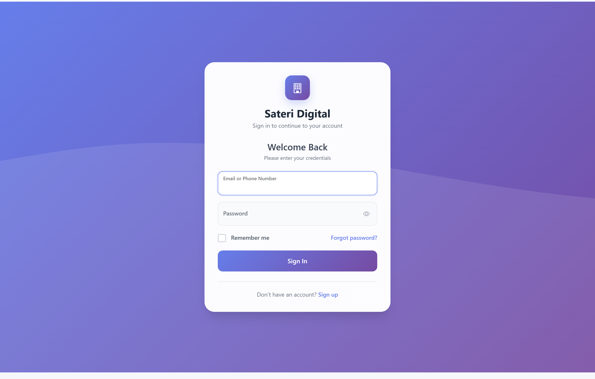
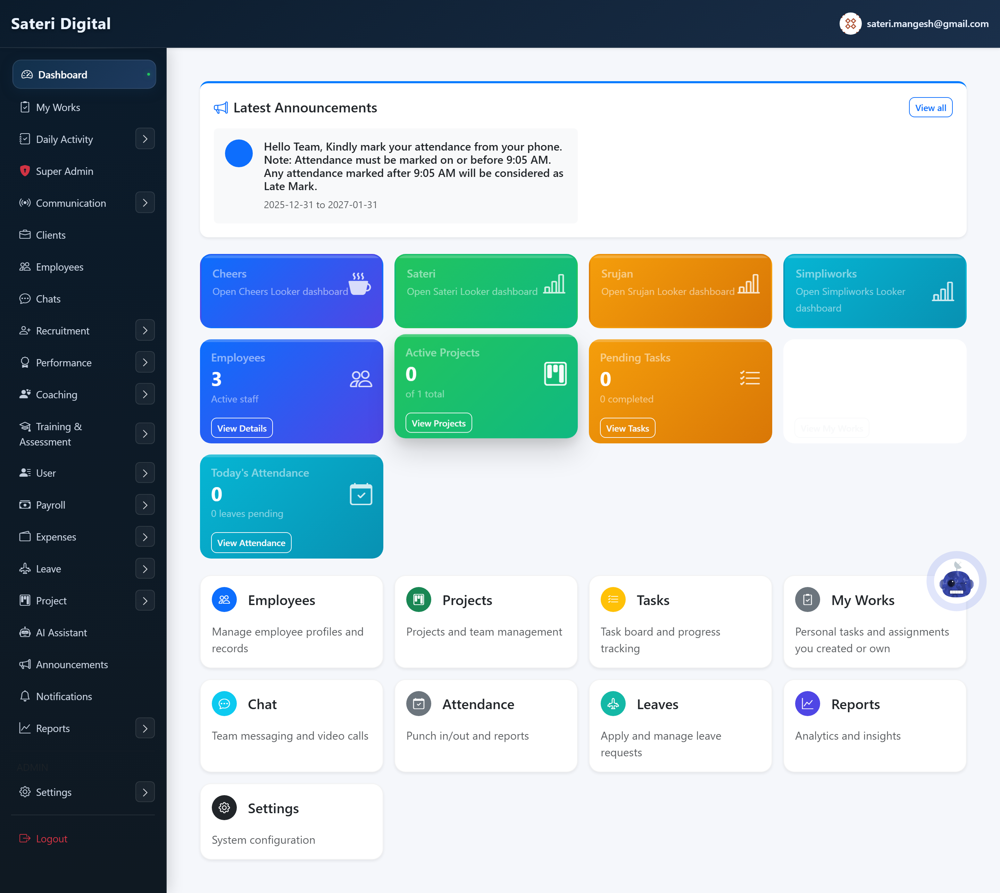
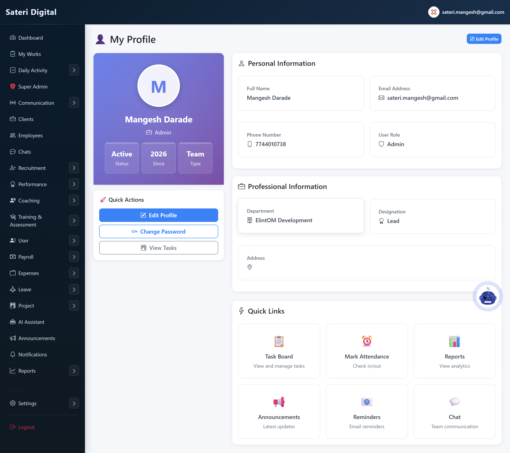
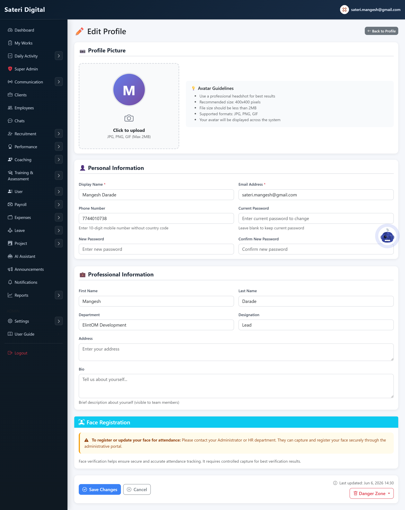
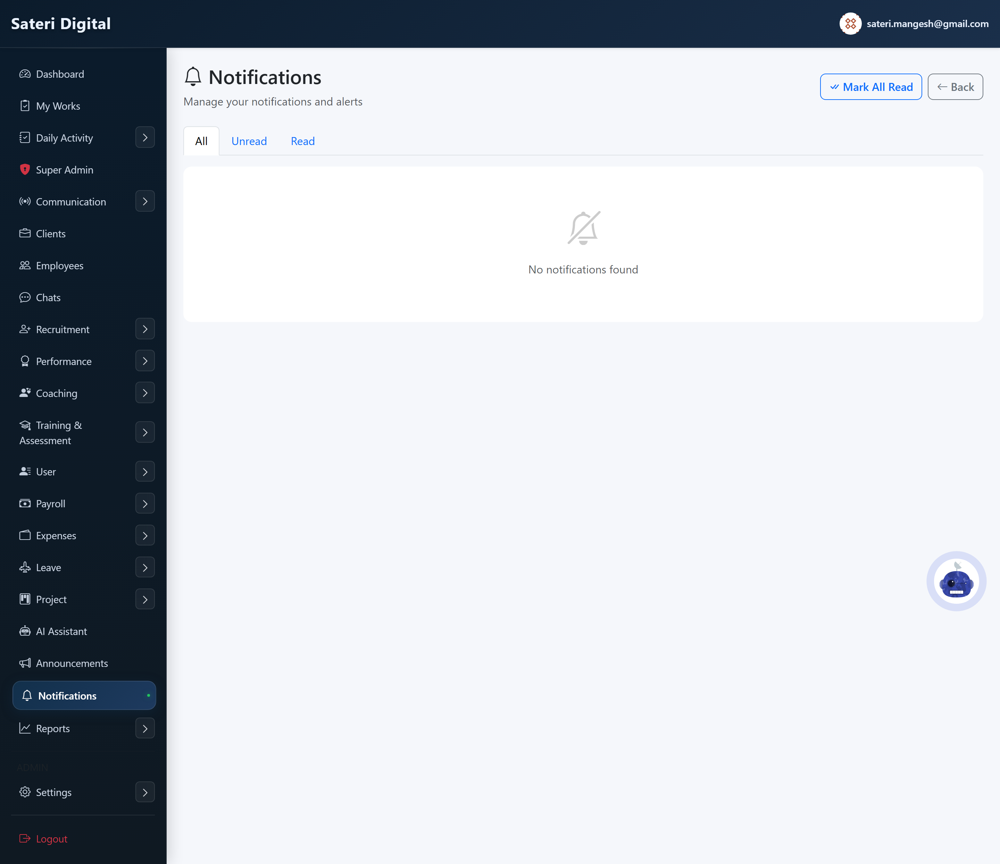

# Module 01 — Login & Dashboard

## What is this module for?

Sign in securely, see your home summary, update your profile, and read alerts.

---

## Login

**Purpose:** Open the app with your email or phone and password.

**Menu:** Login page

---

## Forgot password

**Purpose:** Reset your password using your registered mobile number and OTP.

**Menu:** Forgot password link on login

---

## Dashboard

**Purpose:** Quick overview of tasks, leave, attendance, and announcements for your role.

**Menu:** Dashboard

### Mark attendance (dashboard)

**Purpose:** Check in or check out quickly from the home page without opening the full attendance list.

**Who sees it:** All logged-in users — the card appears directly below announcements.

**What it shows:**

- Today's status (not checked in, checked in, or complete)
- Check-in and check-out times when already recorded
- **Mark attendance** — opens the punch screen (`attendance/create`)
- **View list** — opens the attendance summary (if you have attendance access)

**Steps:**

1. Open **Dashboard**.
2. Find the **Mark attendance** card below announcements.
3. Tap **Mark attendance** to check in or out (face and location may be required per company settings).
4. Use **View list** to see your team's attendance summary (managers/admins).

---

## Profile

**Purpose:** View and update your personal details, password, and photo.

**Menu:** Top right → Profile

### Edit (update existing)

**Steps:**

1. Change fields or password.
2. Upload avatar.
3. Save.

### Delete / remove

**How:**

1. Remove avatar uses the button on edit profile.
2. Account delete is admin-only.

---

## Notifications

**Purpose:** See task, leave, and system alerts. Mark read or open linked pages.

**Menu:** Notifications

### Delete / remove

**How:**

1. Open a notification → Delete button on the row (if shown).
2. Mark all read clears the badge without deleting history.

---

**Next module:** [02 — People & Organization](02-people-organization.md)
