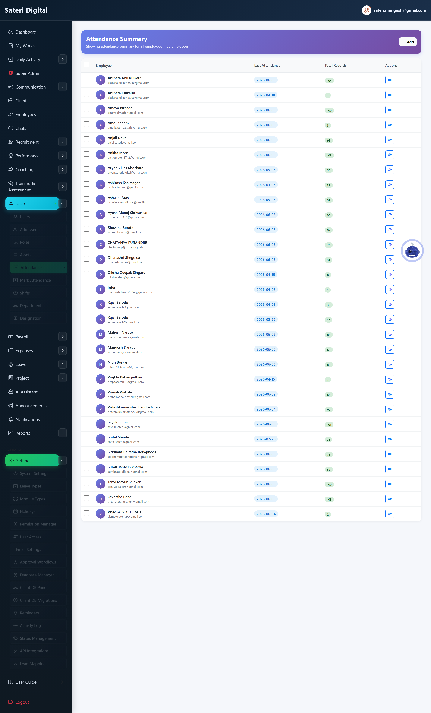
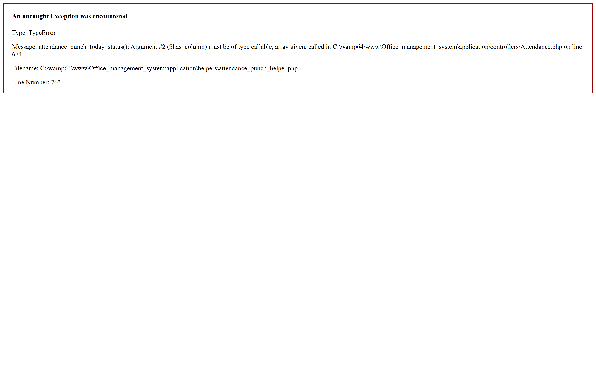
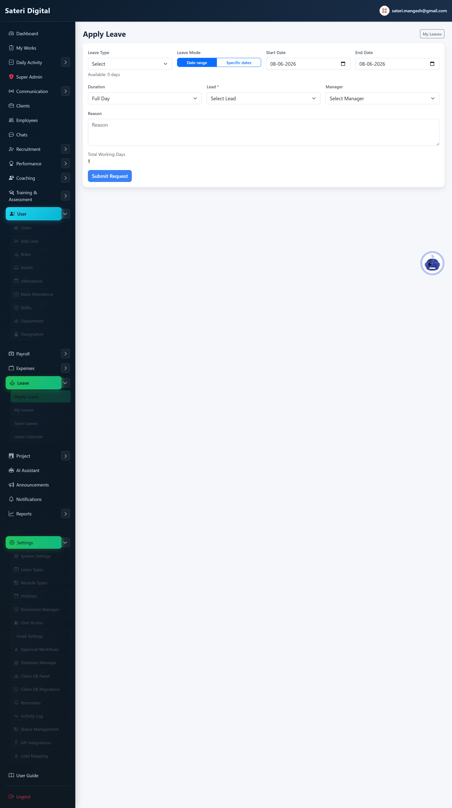
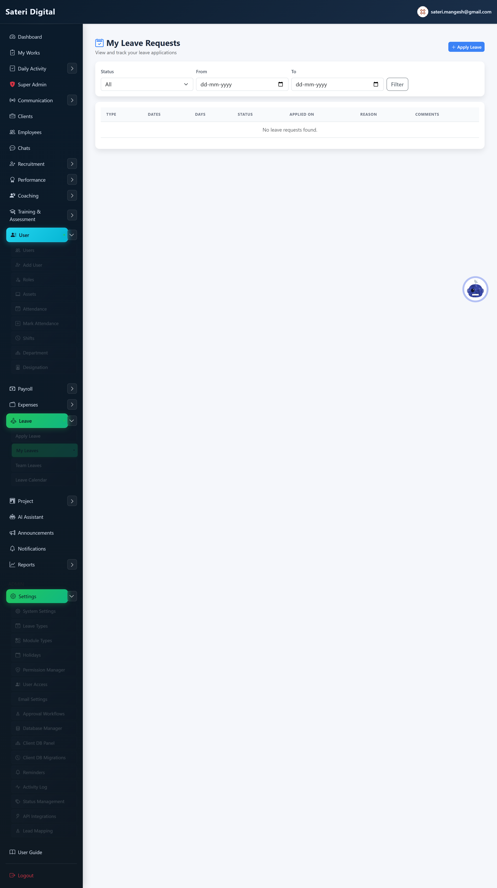
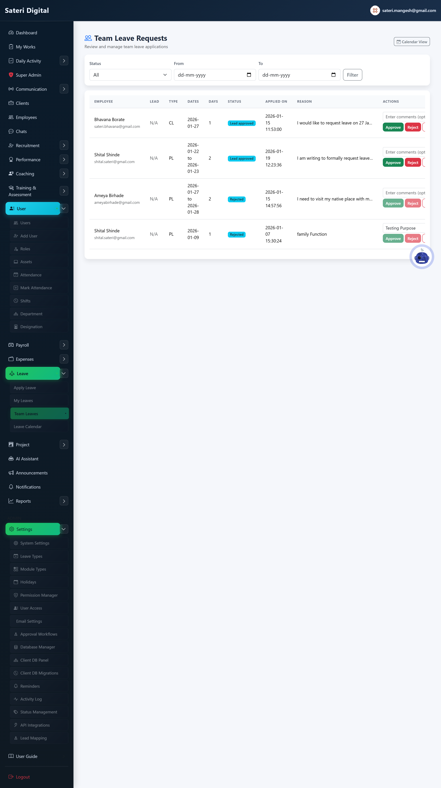
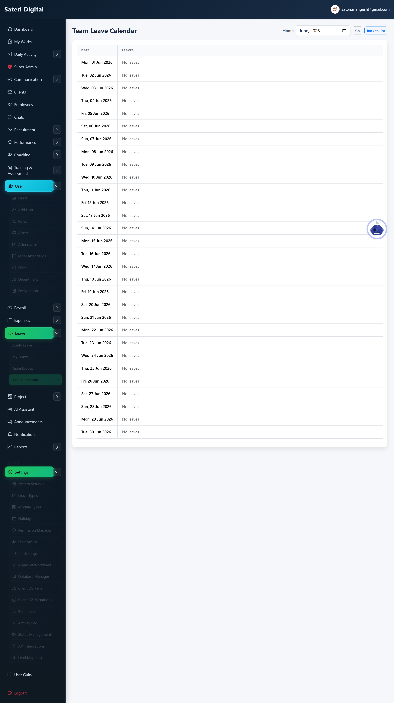
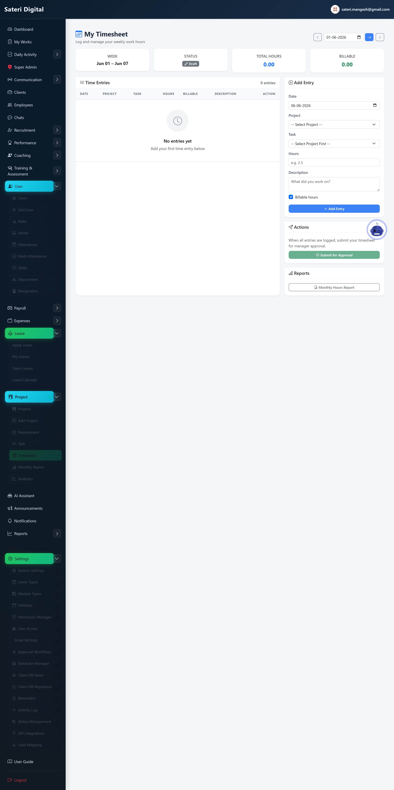

# Module 03 — Attendance & Leave

## What is this module for?

Record daily punch in/out, request time off, approve team leave, and log timesheets.

---

## Attendance

**Purpose:** Daily punch in and punch out with optional location or face check.

**Menu:** User Management → Attendance

### Add (create new)

**Steps:**

1. Admin: Mark Attendance.
2. Pick employee, date, in/out times.
3. Save.

### Edit (update existing)

**Steps:**

1. Admin: open record → Edit.
2. Fix punch times → Save.

### Delete / remove

**How:**

1. Admin delete from attendance edit or list.

---

## Apply leave

**Purpose:** Request casual, sick, WFH, or other leave types.

**Menu:** Leave → Apply Leave

### Add (create new)

**Steps:**

1. Fill type, dates, reason.
2. Submit → manager notified.

### Edit (update existing)

**Steps:**

1. My Leaves → open pending request → Edit.

### Delete / remove

**How:**

1. My Leaves → Delete while status is Pending only.

---

## My leaves

**Purpose:** Track your leave request status.

**Menu:** Leave → My Leaves

---

## Team leaves

**Purpose:** Managers approve or reject team leave requests.

**Menu:** Leave → Team Leaves

### Edit (update existing)

**Steps:**

1. Open request → Approve or Reject with comment.

---

## Leave calendar

**Purpose:** See who is off on which days.

**Menu:** Leave → Calendar

---

## Timesheets

**Purpose:** Log hours against projects separately from attendance punch.

**Menu:** Project → Timesheets

### Add (create new)

**Steps:**

1. Add row with project, task, hours.
2. Submit for approval if required.

### Edit (update existing)

**Steps:**

1. Edit entry before approval.

### Delete / remove

**How:**

1. Delete draft entries from timesheet list.

---

**Next module:** [04 — Projects & Tasks](04-projects-tasks.md)
