# Module 04 — Projects & Tasks

## What is this module for?

Plan projects, capture requirements, assign tasks, track releases and defects, and manage status on a board.

---

## Projects

**Purpose:** Group work by client with dates, members, and status; portfolio matrix by delivery and timeline risk.

**Menu:** Project → Projects

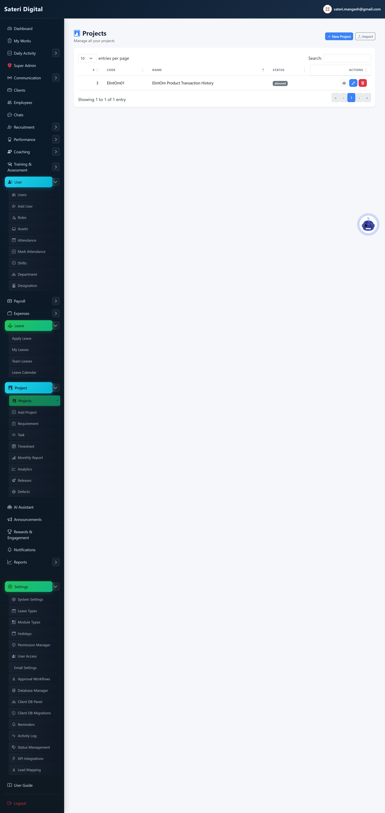

### Add (create new)

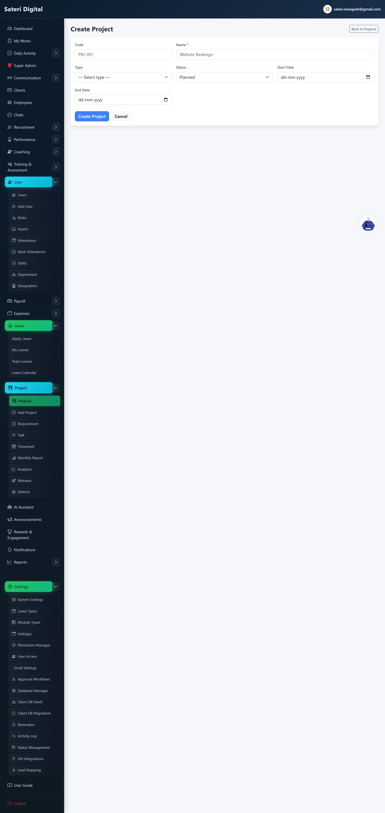

### Edit (update existing)

**Steps:**

1. Open Portfolio Matrix (projects/matrix).
2. Quadrants: Quick Wins, Major Projects, Fill-ins, Hard Slogs.
3. Click project name → project detail.

### Delete / remove

**How:**

1. Delete from project detail (admin).
2. Add members after create.
3. On project detail, Save note and History (Date / Comments / Added By) work like Defects.

---

## Project Members

**Purpose:** Assign users to a project and set their role (manager, lead, developer, tester, viewer, member) for access and team visibility.

**Menu:** Project → Projects → project detail → Manage Members

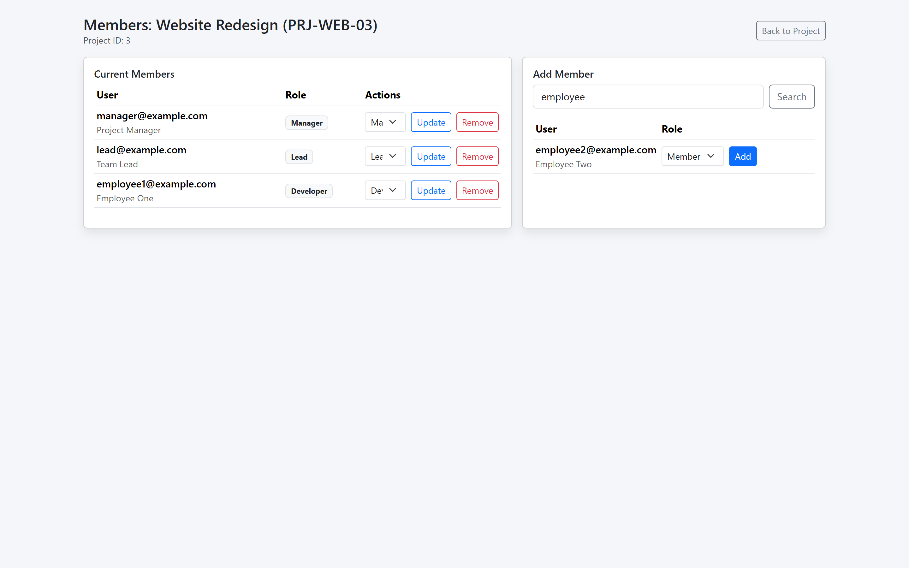

### Add (create new)

**Steps:**

1. Open Manage Members from project detail.
2. Search user by email or name.
3. Pick role and click Add.

### Edit (update existing)

**Steps:**

1. Change role in Current Members table.
2. Click Update.

### Delete / remove

**How:**

1. Click Remove on a member row.
2. Confirm removal.

---

## Projects (Portfolio Matrix)

**Purpose:** 4-quadrant Action Priority Matrix (Effort × Impact): Quick Wins, Major Projects, Fill-ins, Hard Slogs.

**Menu:** Project → Portfolio Matrix

### Edit (update existing)

**Steps:**

1. Filter by status, client, or search.
2. Click project name → project detail.
3. Open linked My Works or Task board from card.

---

## Requirements

**Purpose:** Store specs linked to projects and tasks.

**Menu:** Project → Requirements

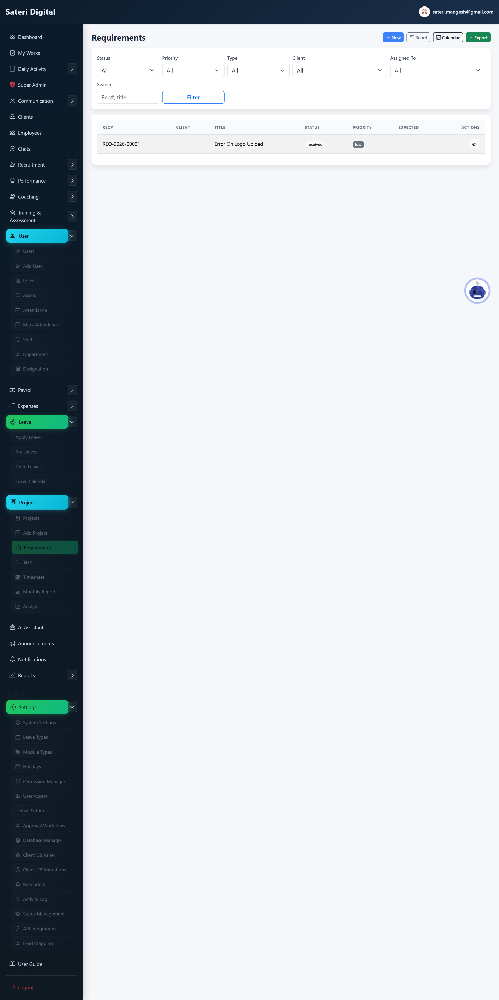

### Add (create new)

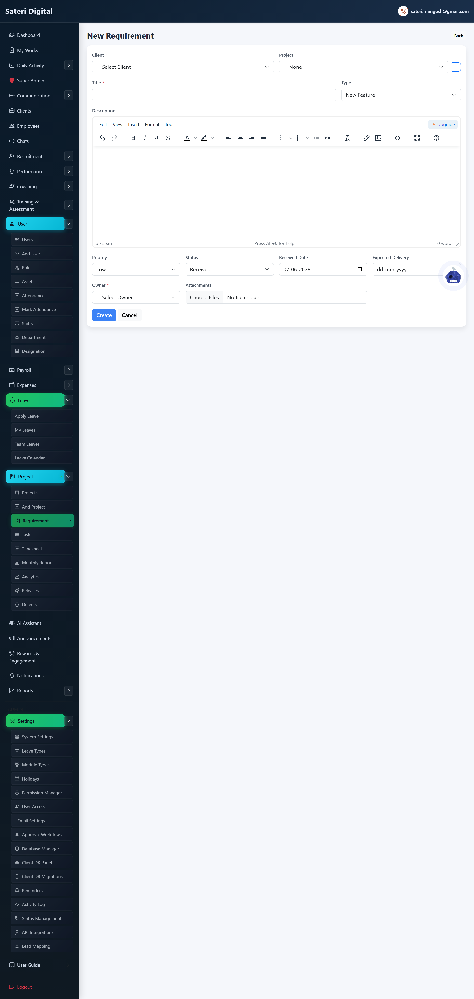

### Edit (update existing)

### Delete / remove

**How:**

1. Delete from requirement detail.

---

## Tasks (list)

**Purpose:** Assign and filter work with priority and due dates.

**Menu:** Project → Task

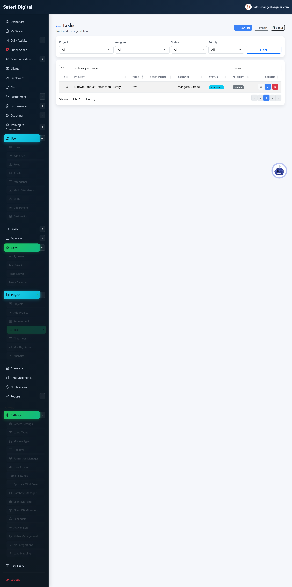

### Add (create new)

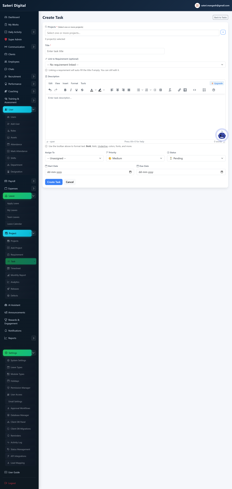

### Edit (update existing)

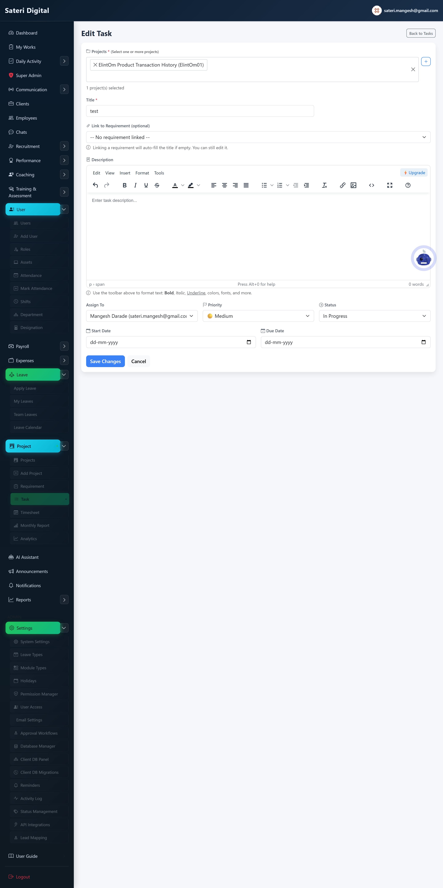

### Delete / remove

**How:**

1. Delete from task detail.
2. Comments on task detail page.

---

## Tasks (board)

**Purpose:** Drag cards between Pending, In Progress, Done.

**Menu:** Project → Task → Board

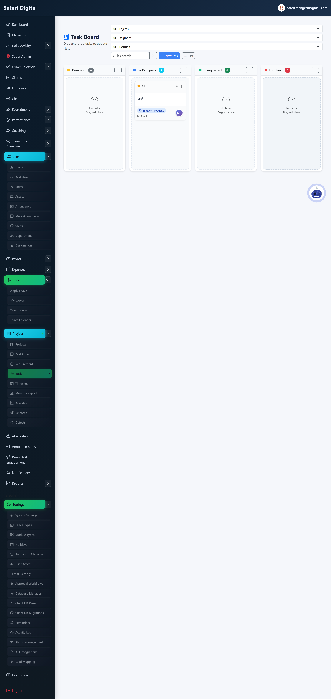

### Edit (update existing)

**Steps:**

1. Drag card or change status dropdown.

---

## Approvals

**Purpose:** Admin: configure multi-step approval workflows.

**Menu:** Approvals

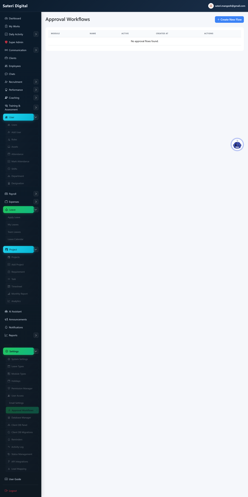

### Add (create new)

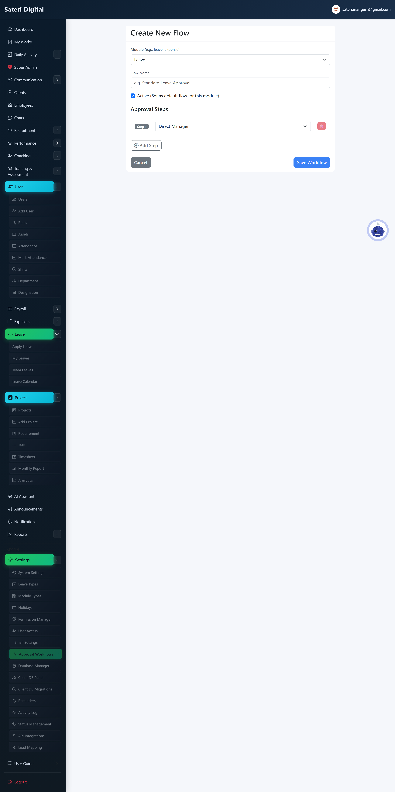

### Edit (update existing)

### Delete / remove

**How:**

1. Delete workflow from approvals list.

---

## Releases

**Purpose:** Track project version releases, document release note points, and email stakeholders via Reminders when a release goes live.

**Menu:** Project → Releases

### Add (create new)

**Steps:**

1. Pick project and version.
2. Add release note points (what is included).
3. Set planned date → Save.

### Edit (update existing)

**Steps:**

1. Open release → Add or edit release note points.
2. Use Add all fixed defects to notes for bulk changelog.
3. Review related defects (Add to notes per item).
4. Select recipients and Send notes now, or check Send when I save.
5. Set status to Released when live.

### Delete / remove

**How:**

1. Open release edit → Delete (soft delete, admin).

---

## Defects

**Purpose:** Log, assign, and resolve bugs linked to projects, releases, and tasks.

**Menu:** Project → Defects

### View list

**Steps:**

1. Filter by client, project, status, severity, assignee, or overdue.
2. List shows all non-deleted defects; use the Active switch to mark inactive (dimmed) without changing workflow status.
3. Open a row to view details or edit.

### Add (create new)

**Steps:**

1. Optionally select Client to filter projects.
2. Select project (required).
3. Describe issue and steps to reproduce.
4. Assign if known → Save.

### Edit (update existing)

**Steps:**

1. Open defect → Edit status to Fixed/Verified/Closed when resolved.
2. Or toggle Active on the list to deactivate without changing open/fixed status.
3. Set due date for SLA tracking.
4. Review History table for all changes; optionally add a history note.

### Delete / remove

**How:**

1. Open defect detail → Delete (soft delete, admin).

---

**Next module:** [05 — Work Tracking](05-work-tracking.md)
