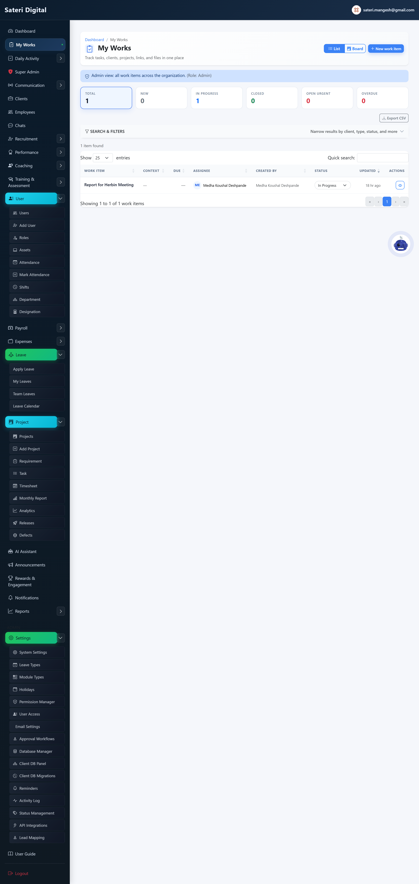
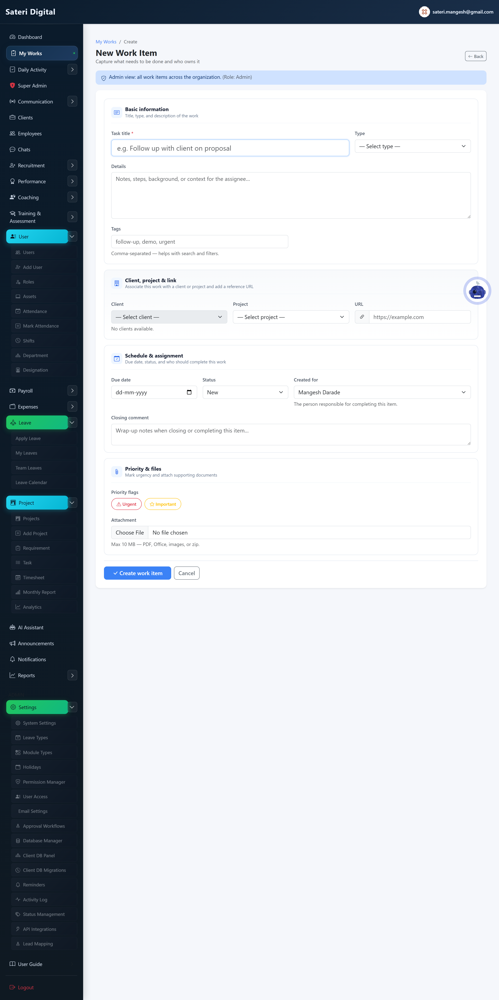
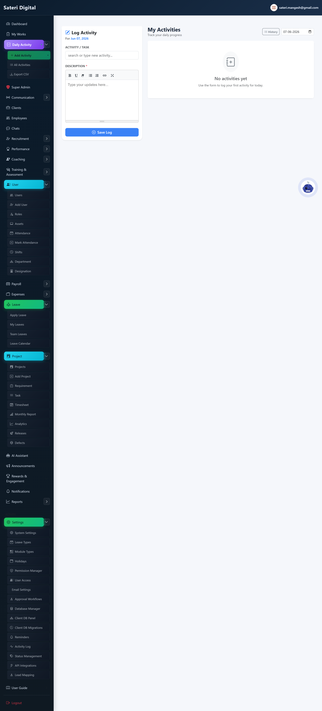
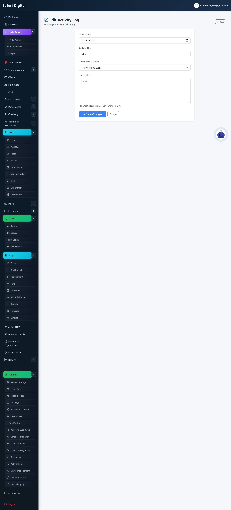
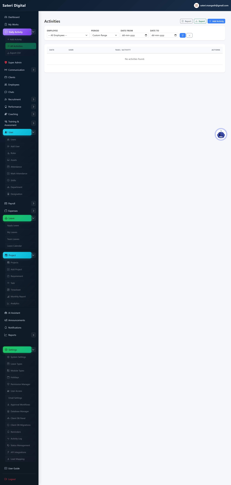
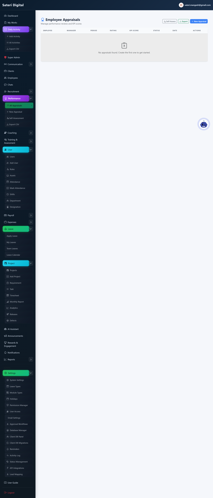
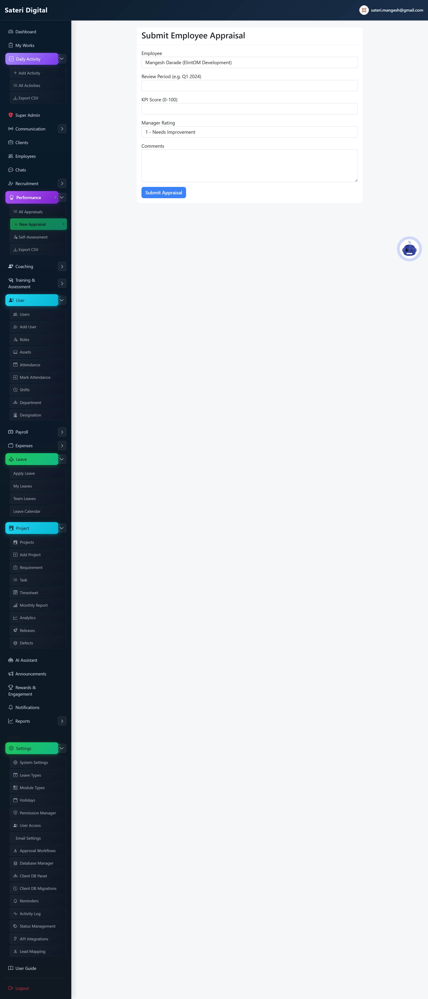

# Module 05 — Work Tracking

## What is this module for?

Personal to-dos, daily activity logs, and performance appraisals.

---

## My Works

**Purpose:** Your internal to-do list with attachments, assignees, and Eisenhower priority matrix by project.

**Menu:** My Works

### Add (create new)

### Edit (update existing)

**Steps:**

1. List, Board, or Matrix view.
2. Matrix uses Action Priority (Effort × Impact); drag to reprioritize.
3. Mark Important/Urgent on form; click project for project detail.

### Delete / remove

**How:**

1. Open item → Delete.
2. Export filtered list from list page.

---

## Daily Activity

**Purpose:** Log what you worked on each day for managers.

**Menu:** Daily Activity

### Add (create new)

**Steps:**

1. Fill date, project, description → Submit.

### Edit (update existing)

### Delete / remove

**How:**

1. All Activities list → Delete row (if permitted).

---

## All Activities

**Purpose:** Browse and export team daily activity.

**Menu:** Daily Activity → List

---

## Performance

**Purpose:** HR appraisal cycles and employee self-assessment.

**Menu:** Performance

### Add (create new)

### Edit (update existing)

### Delete / remove

**How:**

1. HR can delete draft appraisals.

---

**Next module:** [06 — Reports & Analytics](06-reports-analytics.md)
