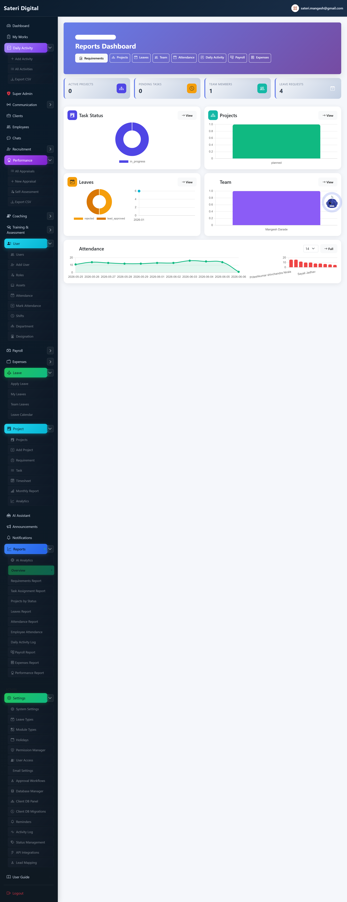
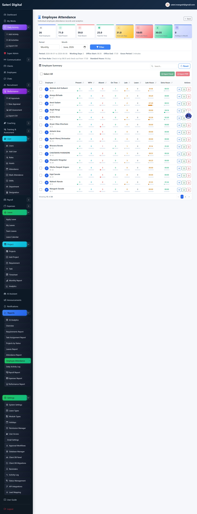
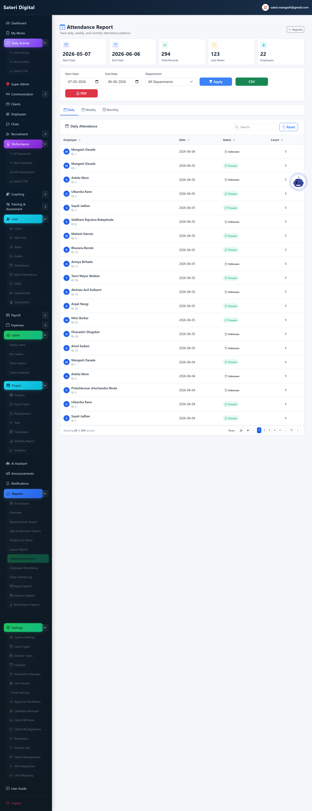
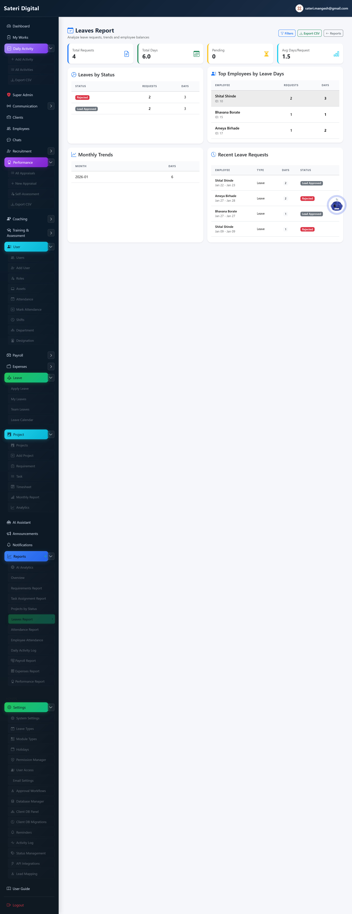
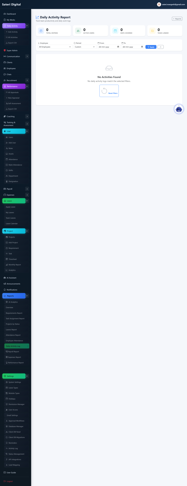
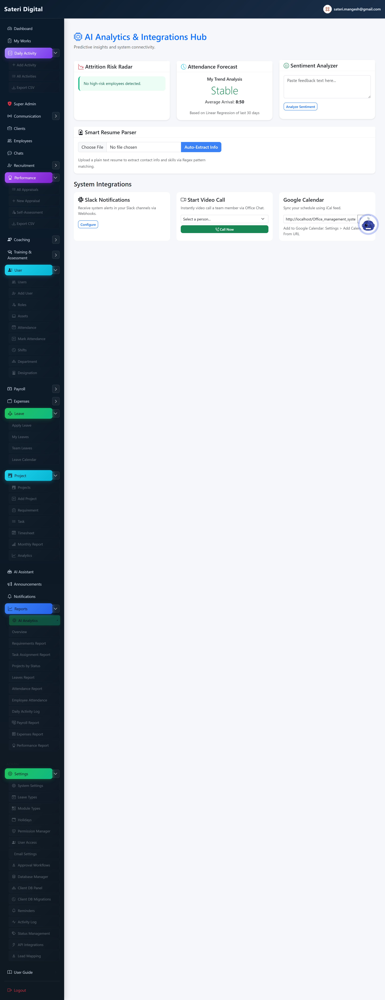
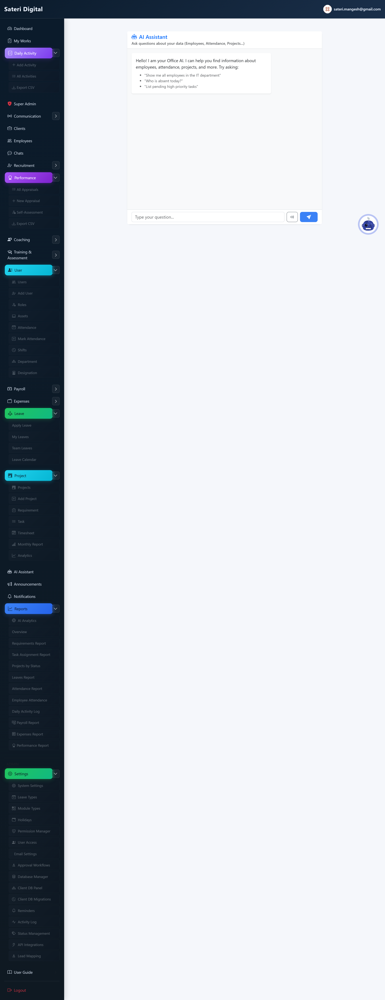

# Module 06 — Reports & Analytics

## What is this module for?

Export attendance, leave, tasks, payroll, and ask the AI assistant questions.

---

## Reports home

**Purpose:** Jump to any report type you have permission for.

**Menu:** Reports

---

## Employee attendance

**Purpose:** Per-person present, absent, late, leave summary and export.

**Menu:** Reports → Employee Attendance

---

## Org attendance

**Purpose:** Company-wide attendance for a date range.

**Menu:** Reports → Attendance

---

## Leave report

**Purpose:** Leave balances and usage.

**Menu:** Reports → Leaves

---

## Task assignment

**Purpose:** Who is assigned to which tasks.

**Menu:** Reports → Task Assignment

---

## Daily activity report

**Purpose:** Manager view of staff activity logs.

**Menu:** Reports → Daily Activity

---

## AI Analytics

**Purpose:** AI insights on operational data.

**Menu:** Analytics

---

## AI Assistant

**Purpose:** Ask questions in plain English; get tables and exports.

**Menu:** AI Assistant

---

**Next module:** [07 — Communication](07-communication.md)
