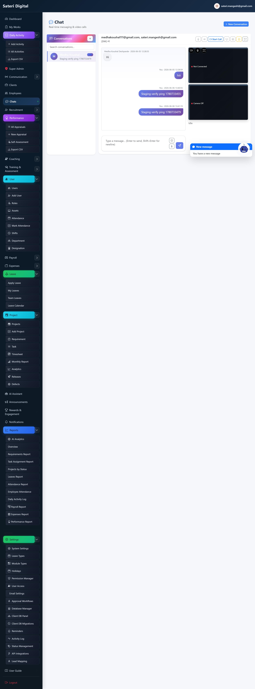
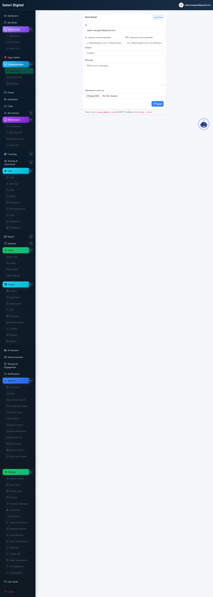
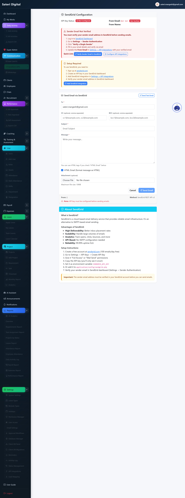
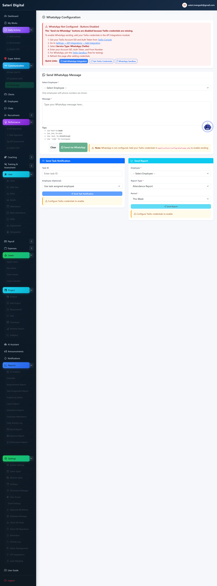
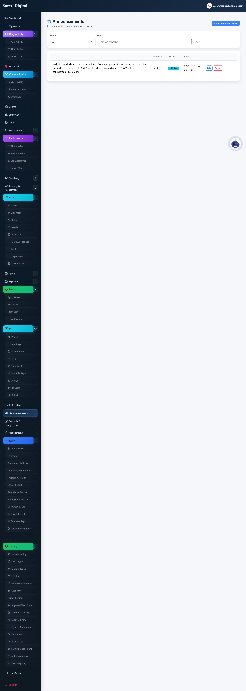
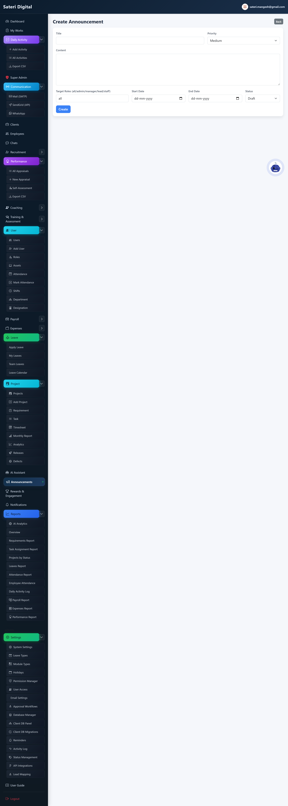
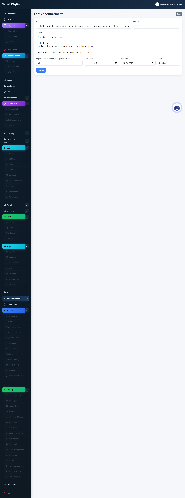
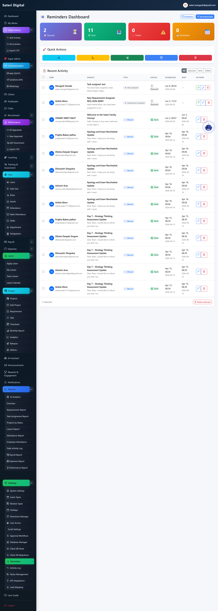

# Module 07 — Communication

## What is this module for?

Chat with colleagues, send mail, post announcements, and schedule reminders.

---

## Chats

**Purpose:** Direct messages and group chat with file attachments.

**Menu:** Chats

### Add (create new)

**Steps:**

1. Start DM or create group (admin).

### Edit (update existing)

**Steps:**

1. Edit or delete your own messages.

### Delete / remove

**How:**

1. Delete message from chat menu.

---

## Mail

**Purpose:** Send email via SMTP from the app.

**Menu:** Mail

### Add (create new)

**Steps:**

1. Compose new mail on mail page.

---

## SendGrid

**Purpose:** API bulk email (admin).

**Menu:** SendGrid

---

## WhatsApp

**Purpose:** Meta Cloud API inbox, templates, and outbound messages (admin).

**Menu:** Communication → WhatsApp

### Add (create new)

**Steps:**

1. Settings → API Integrations → add WhatsApp (Meta Cloud API): Phone Number ID, access token, WABA ID, App Secret, webhook verify token.
2. In Meta App Dashboard set Callback URL to `/whatsapp/webhook`, verify token, and subscribe the `messages` field.
3. Open WhatsApp inbox to read threads and reply. First contact outside the 24-hour window must use an approved template.

### Edit (update existing)

**Steps:**

1. Open a conversation → type a reply (only inside the 24-hour window) or pick an approved template → fill {{variables}} if shown → Send.
2. Chat header shows remaining customer-care window hours, or “Template only” when closed.

---

## WhatsApp Templates

**Purpose:** Sync WhatsApp message templates from Meta and send them.

**Menu:** Communication → Templates

### Add (create new)

**Steps:**

1. Create templates in WhatsApp Manager and wait for Meta approval.
2. Open Communication → Templates → Sync from Meta, or **Add template name** if Graph cannot list them (`hello_world` for Meta test numbers).
3. Use **Test connection** to verify the System User token can access the Phone Number ID. Assign the WhatsApp account to that System User in Business Manager if the test fails.

### Edit (update existing)

**Steps:**

1. Click Send on an APPROVED row, enter phone, send.

### Delete / remove

**How:**

1. Delete removes the local cache row only, not the template in WhatsApp Manager.

---

## Announcements

**Purpose:** Company news on dashboard and email.

**Menu:** Announcements

### Add (create new)

### Edit (update existing)

### Delete / remove

**How:**

1. Delete from announcements list.

---

## Reminders

**Purpose:** Scheduled email campaigns and templates.

**Menu:** Settings → Reminders

### Add (create new)

**Steps:**

1. Create template or schedule.
2. Bulk send or import CSV.

### Edit (update existing)

**Steps:**

1. Edit schedule or template from list.

### Delete / remove

**How:**

1. Delete reminder or template from list.

---

**Next module:** [08 — Finance](08-finance.md)
