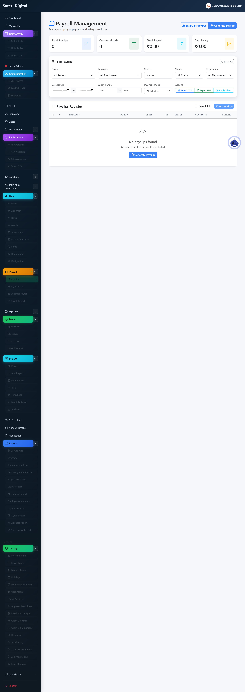
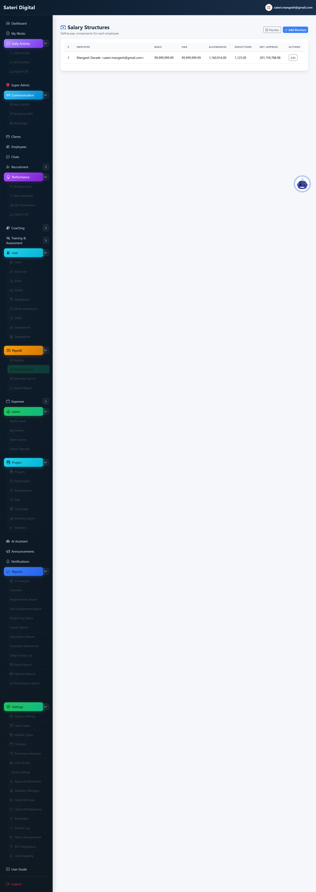
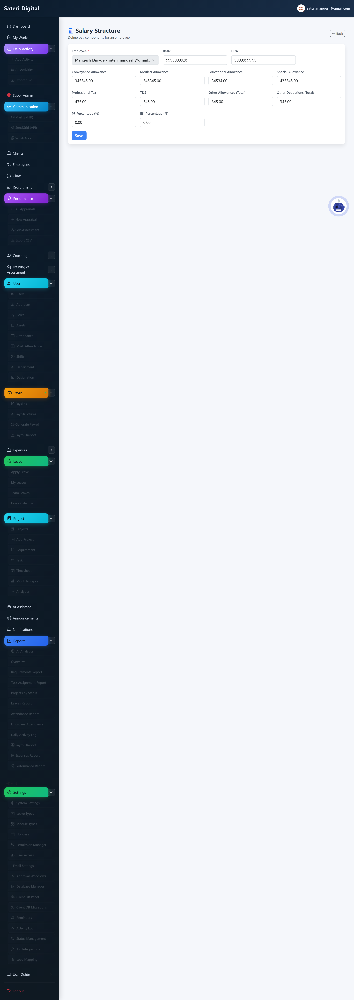
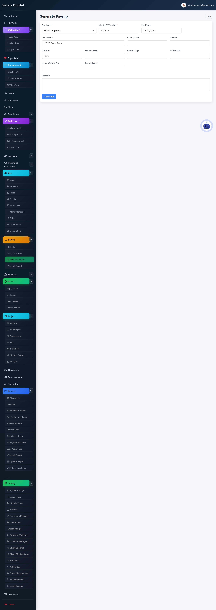
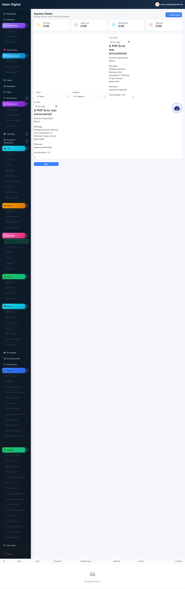
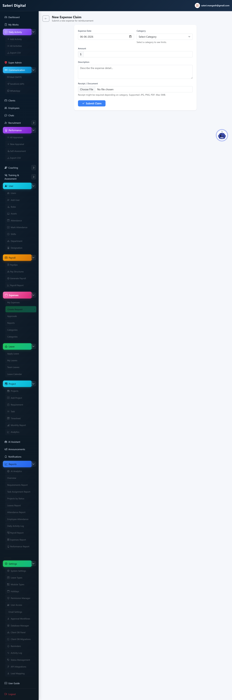
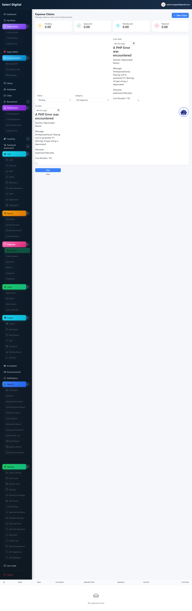
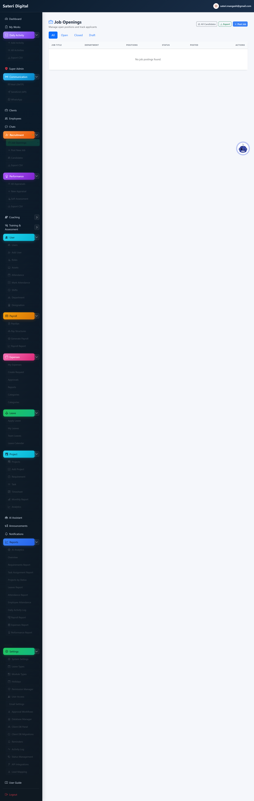
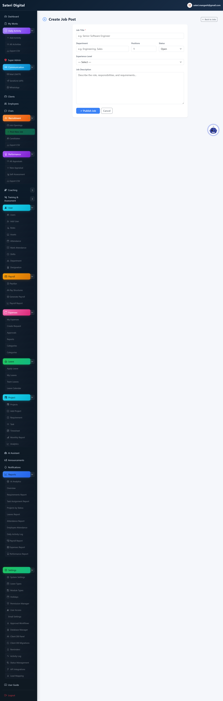

# Module 08 — Finance

## What is this module for?

Payroll, expense claims, and recruitment.

---

## Payslips

**Purpose:** View salary slips.

**Menu:** Payroll → Payslips

---

## Pay structures

**Purpose:** Salary templates per employee.

**Menu:** Payroll → Pay Structures

### Add (create new)

### Edit (update existing)

### Delete / remove

**How:**

1. Remove structure if not in use.

---

## Generate payroll

**Purpose:** Run payroll for a month.

**Menu:** Payroll → Generate

### Add (create new)

**Steps:**

1. Select period → preview → confirm.

---

## Expenses

**Purpose:** Submit reimbursement claims with receipts.

**Menu:** Expenses

### Add (create new)

### Edit (update existing)

### Delete / remove

**How:**

1. Delete draft before approval.
2. Manager approves from Pending.

---

## Pending expenses

**Purpose:** Manager queue to approve or reject.

**Menu:** Expenses → Pending

### Edit (update existing)

**Steps:**

1. Approve, Reject, or mark Reimbursed.

---

## Recruitment

**Purpose:** Job posts and candidate pipeline.

**Menu:** Recruitment

### Add (create new)

### Edit (update existing)

### Delete / remove

**How:**

1. Close or delete job posting.
2. Update candidate status on profile.

---

**Next module:** [09 — Training & Coaching](09-training-coaching.md)
