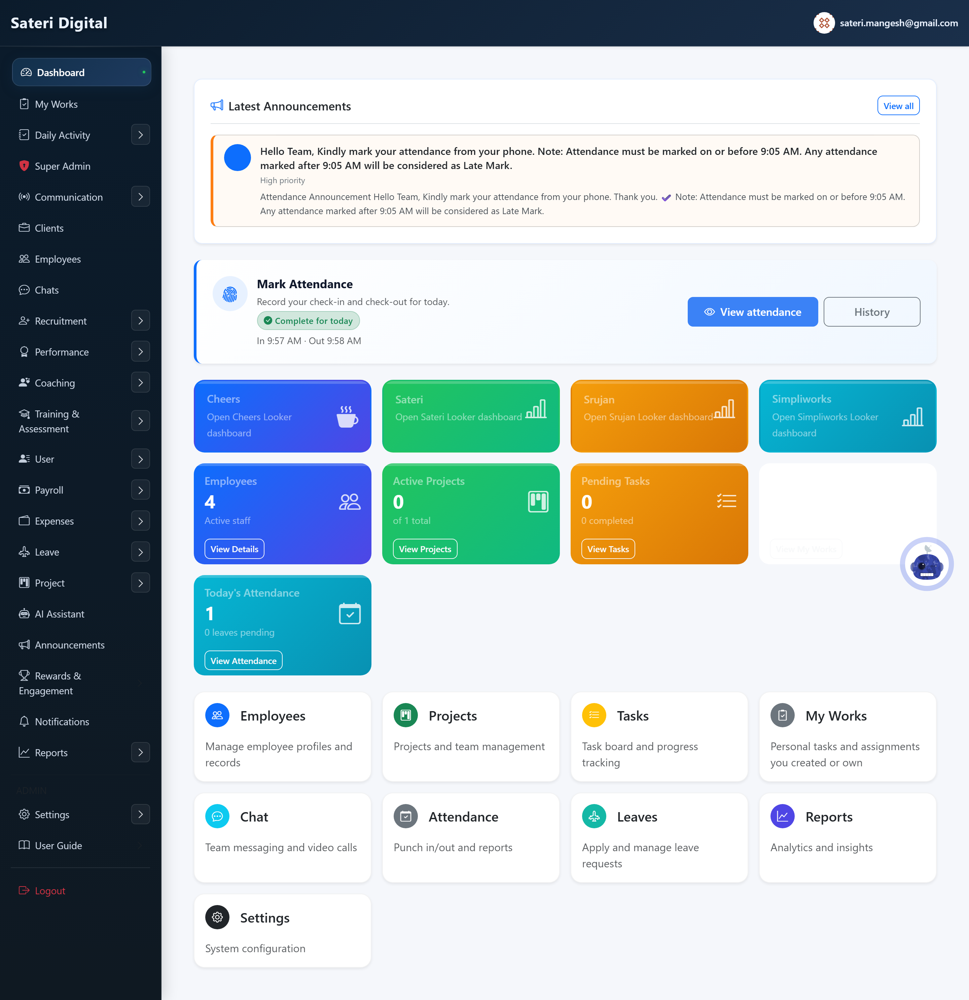
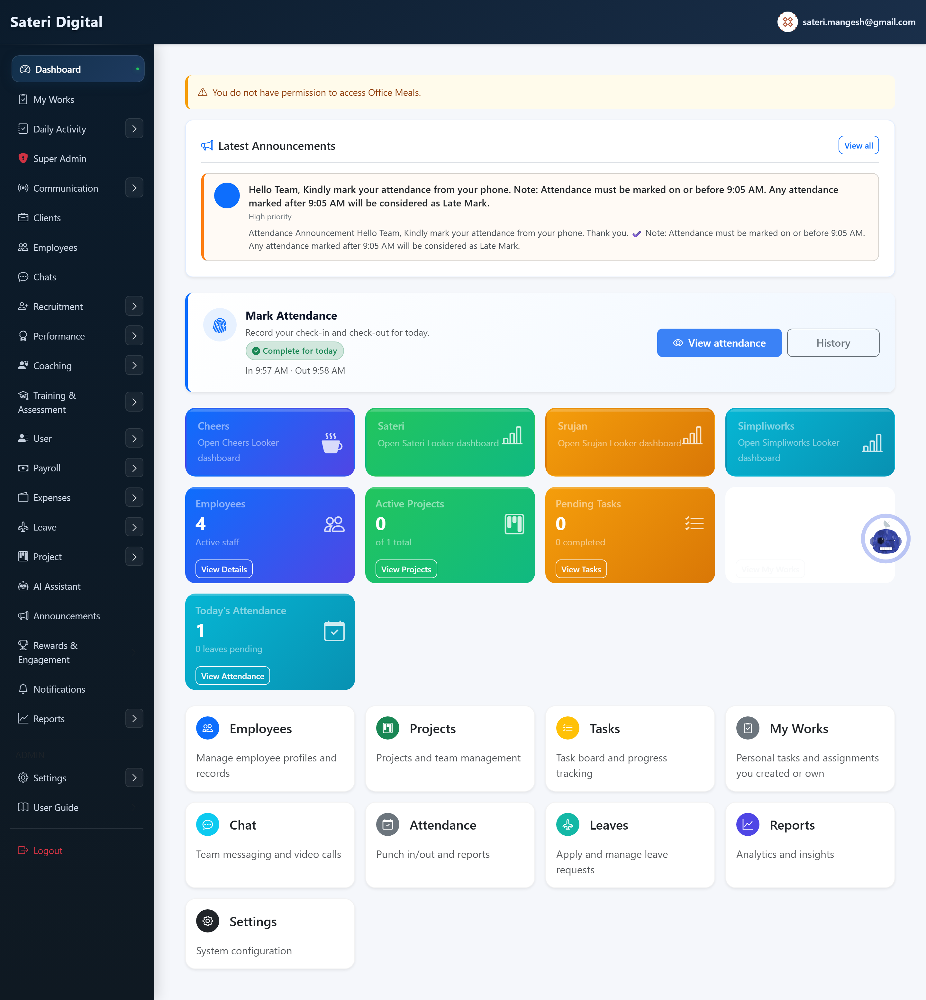
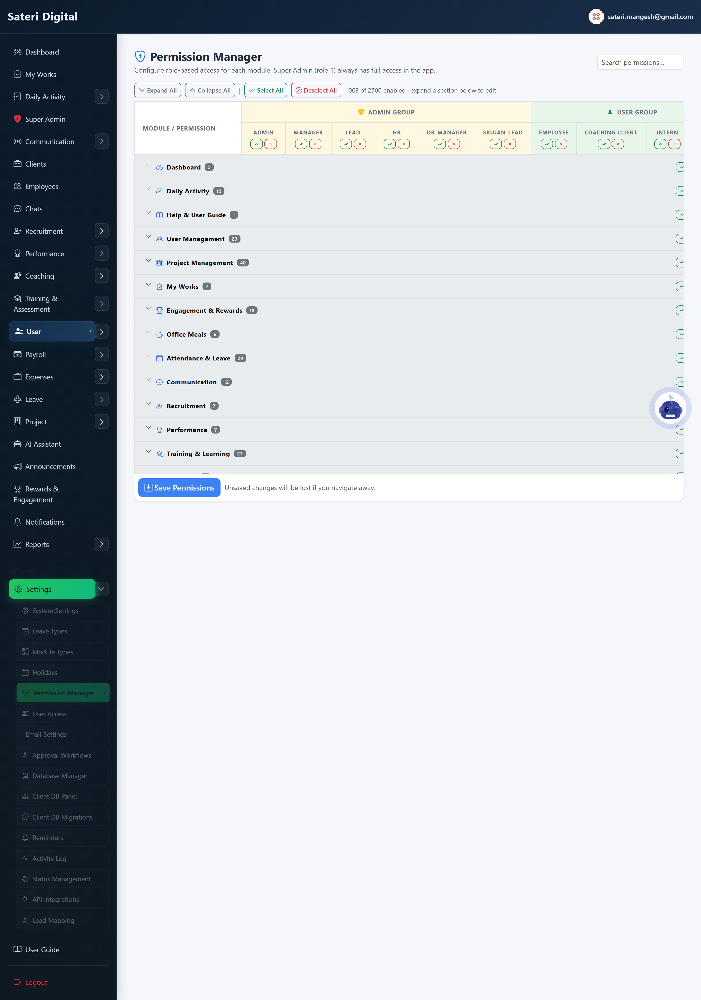

# Module 12 — Office Meals

## What is this module for?

Order breakfast and lunch, manage the meal calendar, provider counts, change requests after cut-off, and org-wide order reports.

---

## My Orders

**Purpose:** Order today's breakfast (0–3 plates) and lunch (none / half / full tiffin). Auto-saves. Tomorrow is preview only. After cut-off, request a change for provider approval.

**Menu:** Office Meals → My Orders

### How to use

**Steps:**

1. See Today and Tomorrow on one page.
2. Breakfast: pick plate count (auto-saves).
3. Lunch: pick No / Half tiffin / Full tiffin.
4. After lock: use Request change if you need a different order.

---

## Meal Calendar

**Purpose:** Plan which dates have breakfast and lunch; optional menu notes. Can auto-publish dashboard announcements.

**Menu:** Office Meals → Calendar

### Add (create new)

**Steps:**

1. Open month view.
2. Tick breakfast/lunch per date.
3. Add menu notes.
4. Save calendar.

---

## Meal Provider

**Purpose:** Daily plate/tiffin counts after cut-off, approve or reject employee change requests, export CSV.

**Menu:** Office Meals → Provider

### How to use

**Steps:**

1. Pick date.
2. Review counts after breakfast/lunch lock.
3. Approve or reject pending change requests.
4. Export CSV if allowed.

---

## Meal Settings

**Purpose:** Cut-off times, max breakfast plates, weekly menu template, email notifications, dashboard announcement toggle.

**Menu:** Office Meals → Settings

### Add (create new)

**Steps:**

1. Set breakfast and lunch cut-offs.
2. Edit Mon–Sun weekly menu.
3. Set provider contact and dashboard announcement toggle.
4. Save settings.
5. Apply weekly menu to calendar.

---

## Meal History

**Purpose:** Audit log of order changes (who changed what and when).

**Menu:** Office Meals → History

### How to use

**Steps:**

1. Filter by date and/or employee.
2. Review change log rows.

---

## All Meal Orders

**Purpose:** Org-wide roster: every employee's breakfast and lunch order for a selected date.

**Menu:** Office Meals → All Orders

### How to use

**Steps:**

1. Pick date.
2. Optionally show only employees with orders.
3. Review totals and per-employee rows.
4. Export CSV if allowed.

---

## Permissions (Office Meals)

**Purpose:** Assign six Screen permissions per role. Unchecked roles cannot see Office Meals in the sidebar.

**Menu:** Settings → Permission Manager → Office Meals

### Edit (update existing)

**Steps:**

1. Expand Office Meals group.
2. Employee: tick My Orders only.
3. Provider: tick Meal Calendar + Meal Provider.
4. Admin: tick all screens or All meal orders.
5. Save permissions.

---

**Next module:** [13 — Sales — EBA Platform](13-sales-eba.md)
